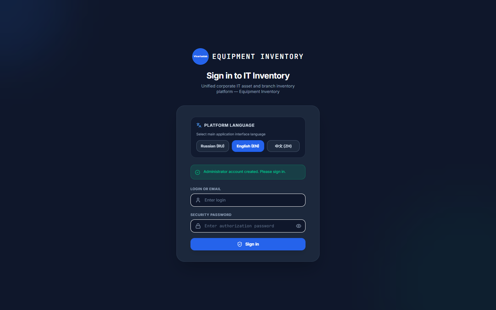
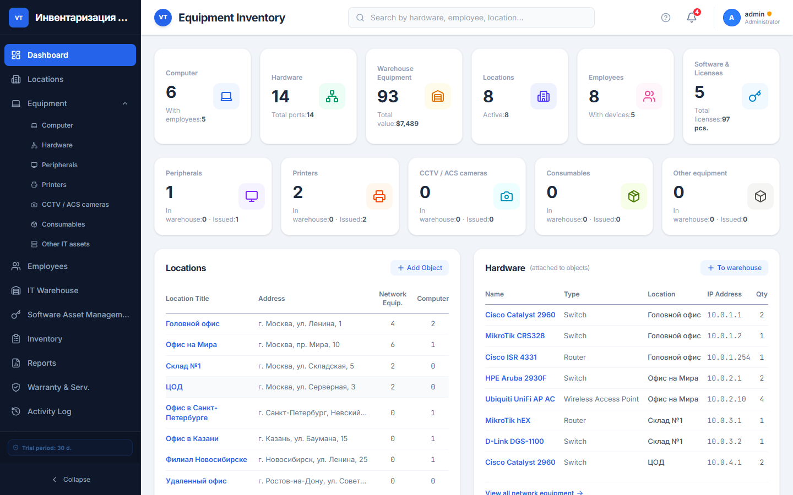
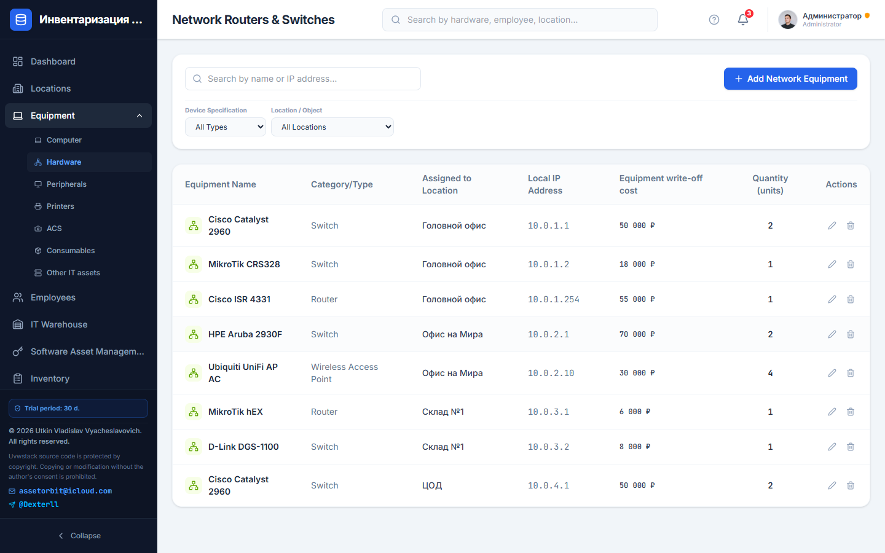
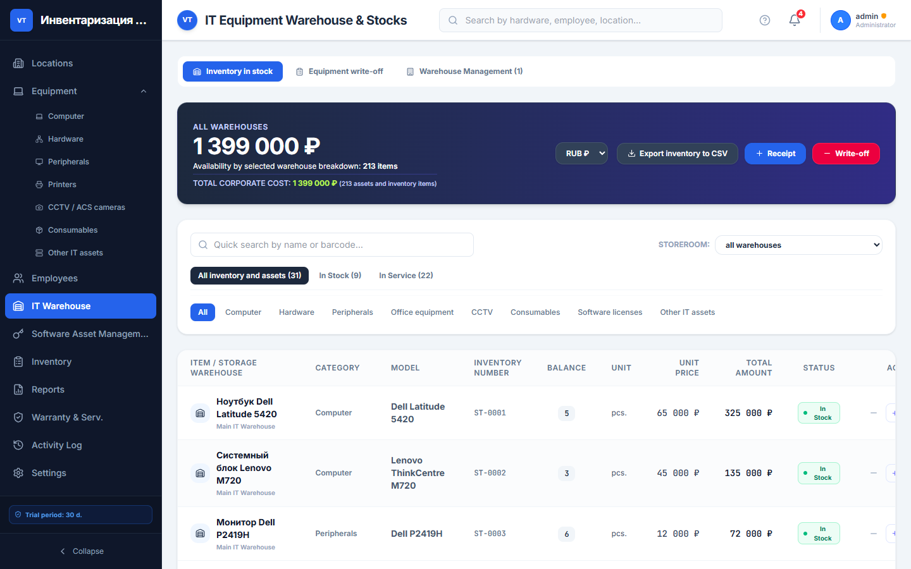
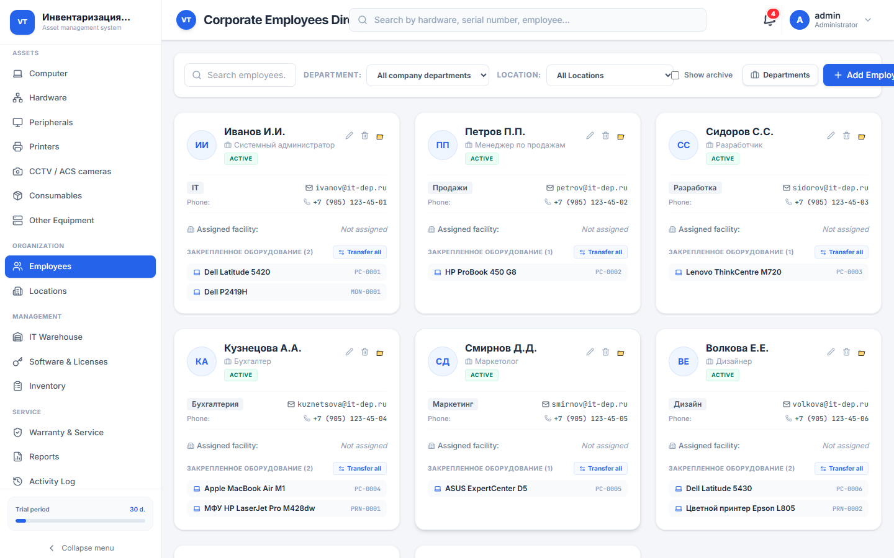
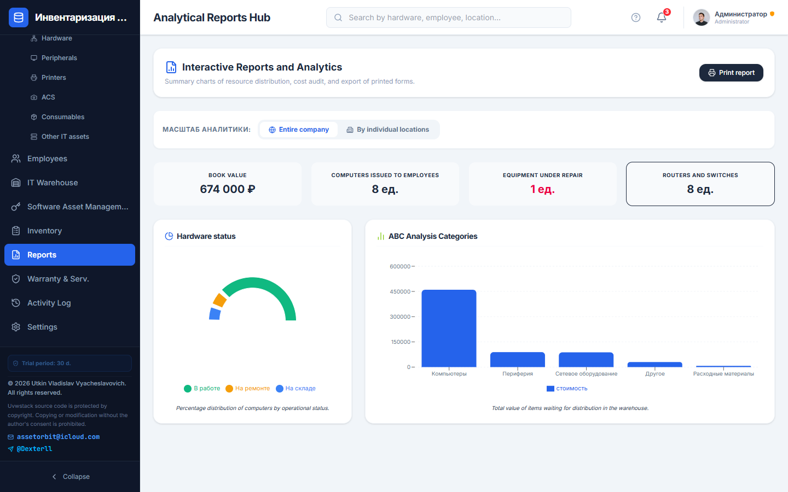
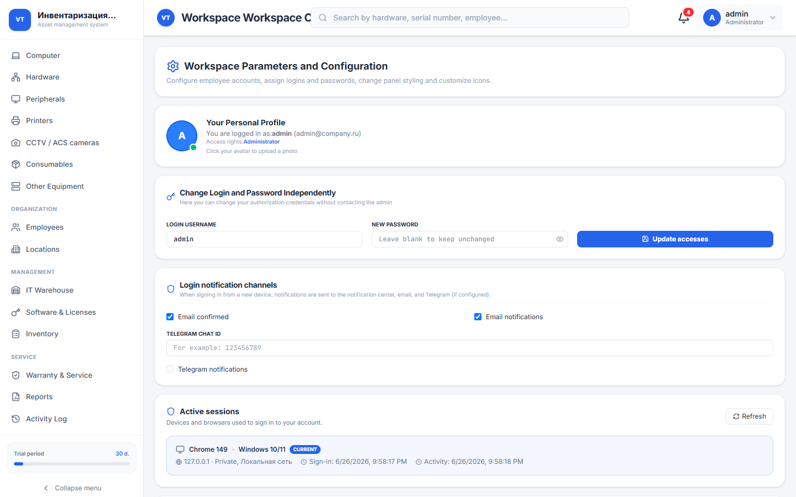

<p align="center">
  <strong>Documentation languages / Языки документации / 文档语言</strong><br>
  <a href="README.md"><b>English</b></a> ·
  <a href="README.ru.md">Русский</a> ·
  <a href="README.zh-CN.md">中文</a>
</p>

# 🚀 Uvwstack (Stack)

<p align="center">
  
  
  
  
  
</p>

<p align="center">
  <strong>Modern IT infrastructure, asset, license, and warehouse management system</strong>
</p>

---

# 📸 Interface screenshots

<p align="center">
  
  <br><em>Login screen</em>
</p>

| Dashboard | Network equipment |
| :---: | :---: |
|  |  |

| IT warehouse | Employees |
| :---: | :---: |
|  |  |

| Reports | Settings |
| :---: | :---: |
|  |  |

---

## 📋 Table of contents

- [Interface screenshots](#-interface-screenshots)
- [About](#-about)
- [Features](#-features)
- [Licensing](#-licensing)
- [Tech stack](#-tech-stack)
- [System requirements](#-system-requirements)
- [Installation](#-installation)
  - [Server preparation](#server-preparation)
  - [Docker Compose](#-option-1-docker-compose-recommended)
  - [Docker + MySQL](#-option-2-docker--mysql-same-network)
  - [Docker + PostgreSQL](#-option-3-docker--postgresql)
  - [Host network + native DB](#-option-4-host-network--native-db-on-ubuntu)
  - [PM2](#-option-5-native-install-pm2)
- [Database setup](#-database-setup)
  - [MySQL](#mysql)
  - [PostgreSQL](#postgresql)
- [Connect Stack to DB](#-connect-database-in-uvwstack)
- [Project structure](#-project-structure)
- [Environment variables](#-environment-variables)
- [Updates](#-system-updates)
- [Troubleshooting](#-troubleshooting)
- [Copyright](#-copyright)
- [Contact](#-contact)

---

# 📖 About

**Uvwstack** (UI name: **Stack**) is a professional web platform for centralized IT asset inventory and management.

Designed for:

- system administrators;
- IT departments;
- asset managers;
- enterprise technical services;
- government and commercial organizations.

Full tracking of:

- computers;
- servers;
- network equipment;
- office devices;
- components;
- software licenses;
- warehouse stock;
- consumables;
- audit and activity logs.

All data is stored centrally and accessed via a modern browser. The UI supports **English**, **Russian**, and **Chinese**.

Repository: [github.com/llDecsterll/uvwstack](https://github.com/llDecsterll/uvwstack)

---

# ✨ Features

## 🖥 Asset management

- PCs and laptops
- Servers
- Printers and MFPs
- Switches and routers
- Components
- Usage and transfer history

## 🌐 Network infrastructure

- IP address management
- Patch panels
- Routers
- Network topology
- Connection maps

## 📦 Warehouse

- Stock in / stock out
- Inventory counts
- On-hand balances
- Cartridges
- Consumables
- Software licenses

## 👥 Responsible persons

- Assign equipment to employees
- Link assets to departments
- Transfer history
- Material responsibility control

## 📊 Reports & audit

- Analytics dashboard
- Activity log
- Inventory audits
- Warranty tracking

## 🔐 Security

- AES-256-CBC data encryption
- Encrypted DB connection credentials
- Automatic DB reconnect and health monitoring
- Backup with license fields excluded
- Distributed deployment (Docker, PM2, MySQL, PostgreSQL)

---

# 🔑 Licensing

Hardware-bound activation.

### Trial period

- 30 days free use
- Countdown starts on first launch

### Activation

On install, a request code is generated:

```text
REQ-XXXX-XXXX-XXXX-CHKS
```

A license key is issued in the form:

```text
UTKIN-XXXX-XXXX-XXXX
```

### License properties

✅ Hardware binding (MAC address)

✅ Digital signature verification

✅ Protection against key copying and brute force

✅ Separate license server (keyserver)

❌ Client cannot generate valid keys locally

---

# 🛠 Tech stack

| Component | Technology |
|-----------|------------|
| Frontend | React 19, TypeScript, Tailwind CSS 4, Motion |
| Backend | Node.js 20, Express |
| API | REST (Express) |
| Database | JSON (file) / MySQL 8 / PostgreSQL 16 |
| Build | Vite 6, esbuild |
| Containers | Docker, Docker Compose |
| Process manager | PM2 |
| Encryption | AES-256-CBC |
| Reverse proxy | Nginx, Caddy (optional) |

---

# 💻 System requirements

| Resource | Minimum | Recommended |
|----------|---------|-------------|
| OS | Ubuntu 20.04+ / Debian 11+ | Ubuntu 22.04 LTS |
| CPU | 1 core | 2 cores |
| RAM | 1 GB | 2 GB (+ DB on same host) |
| Disk | 10 GB free | 20 GB |
| Network | Port 8080 (HTTP) | 443 (HTTPS via proxy) |
| Browser | Chrome, Firefox, Edge (current) | — |

---

# 🚀 Installation

## Server preparation

```bash
cd ~

sudo apt update && sudo apt upgrade -y
sudo apt install -y git curl ca-certificates
```

To remove an old copy:

```bash
rm -rf uvwstack
```

---

## Clone repository

```bash
git clone https://github.com/llDecsterll/uvwstack.git

cd uvwstack

cp .env.example .env
```

> **Important:** set a strong `DB_ENCRYPTION_KEY` in `.env` — a long random string for data encryption.

---

# 🐳 Option 1: Docker Compose (Recommended)

Quick start with JSON storage in a Docker volume.

## Install Docker

```bash
sudo apt update

sudo apt install -y docker.io docker-compose-v2

sudo usermod -aG docker $USER
```

Re-login to your SSH session.

---

## Start the project

```bash
docker compose build --no-cache

docker compose up -d
```

Check status:

```bash
docker compose ps
docker compose logs -f uvwstack-app
```

Open in browser:

```text
http://SERVER_IP:8080
```

Data is stored in Docker volume `uvwstack_data` → `/app/data/`.

---

# 🐳 Option 2: Docker + MySQL (same network)

**Recommended for production** — app and MySQL in one Compose stack.

```bash
docker compose -f docker-compose.yml -f docker-compose.mysql.yml up -d --build
```

| Parameter | Value |
|-----------|-------|
| Host | `mysql` |
| Database | `stack_db` |
| User | `stack_user` |
| Port | `3306` |

Passwords in `.env` (`MYSQL_PASSWORD`, `MYSQL_ROOT_PASSWORD`) — see `.env.example`.

Stack auto-connects on first start via `STACK_DEFAULT_DB_*` variables.

---

# 🐳 Option 3: Docker + PostgreSQL

```bash
docker compose -f docker-compose.yml -f docker-compose.postgres.yml up -d --build
```

| Parameter | Value |
|-----------|-------|
| Host | `postgres` |
| Database | `stack_db` |
| User | `stack_user` |
| Port | `5432` |

---

# 🐳 Option 4: Host network + native DB on Ubuntu

If MySQL or PostgreSQL runs **on the host** and listens on `127.0.0.1`, use host network mode:

```bash
docker compose -f docker-compose.yml -f docker-compose.host.yml up -d --build
```

In Stack DB settings use host **`localhost`**.

---

# ⚙ Option 5: Native install (PM2)

## Install Node.js 20

```bash
curl -fsSL https://deb.nodesource.com/setup_20.x | sudo -E bash -

sudo apt install -y nodejs build-essential
```

---

## Install dependencies

```bash
cp .env.example .env

npm install

npm run build
```

---

## Install PM2

```bash
sudo npm install -g pm2
```

---

## Start application

```bash
PORT=8080 NODE_ENV=production pm2 start dist/server.cjs --name "uvwstack-system"
```

---

## Autostart after reboot

```bash
pm2 startup systemd
```

Run the command PM2 prints, then:

```bash
pm2 save
```

---

# 🗄 Database setup

Use when the DB is installed **natively on Ubuntu** (not via Docker Compose).

## MySQL

### Install

```bash
sudo apt update

sudo apt install -y mysql-server

sudo systemctl enable mysql
sudo systemctl start mysql
```

### Docker access (bind-address)

If Stack runs in Docker (bridge mode), MySQL must accept connections beyond `127.0.0.1`:

```bash
sudo nano /etc/mysql/mysql.conf.d/mysqld.cnf
```

Set:

```ini
bind-address = 0.0.0.0
```

```bash
sudo systemctl restart mysql
```

### Create database

```sql
CREATE DATABASE stack_db CHARACTER SET utf8mb4 COLLATE utf8mb4_unicode_ci;

CREATE USER 'stack_user'@'%' IDENTIFIED BY 'StrongSecPassword@2026';

GRANT ALL PRIVILEGES ON stack_db.* TO 'stack_user'@'%';

FLUSH PRIVILEGES;
```

### Firewall (if needed)

```bash
sudo ufw allow 3306/tcp
sudo ufw reload
```

---

## PostgreSQL

### Install

```bash
sudo apt update

sudo apt install -y postgresql postgresql-contrib
```

### Network access

```bash
sudo nano /etc/postgresql/*/main/postgresql.conf
```

```ini
listen_addresses = '*'
```

```bash
sudo nano /etc/postgresql/*/main/pg_hba.conf
```

Add at the end:

```text
host    all    all    0.0.0.0/0    scram-sha-256
```

```bash
sudo systemctl restart postgresql
```

### Create user and database

```sql
CREATE USER stack_user WITH PASSWORD 'StrongSecPassword@2026';

CREATE DATABASE stack_db OWNER stack_user;
```

---

# 🔗 Connect database in Uvwstack

After startup, open:

```text
http://SERVER_IP:8080
```

### Default login

```text
Login: admin
Password: admin
```

> Change the admin password immediately after first login.

### Settings path

**Settings** → **Database (MySQL / PostgreSQL)**

### Connection parameters

| Parameter | Docker + MySQL | Docker bridge + native DB | Host network / PM2 |
|-----------|----------------|---------------------------|-------------------|
| DB type | MySQL / PostgreSQL | MySQL / PostgreSQL | MySQL / PostgreSQL |
| Host | `mysql` or `postgres` | `172.17.0.1` or `host.docker.internal` | `localhost` |
| Database | `stack_db` | `stack_db` | `stack_db` |
| User | `stack_user` | `stack_user` | `stack_user` |
| MySQL port | `3306` | `3306` | `3306` |
| PostgreSQL port | `5432` | `5432` | `5432` |

> **Note:** `localhost` inside a Docker container is **not** the Ubuntu host. For native DB use `172.17.0.1`, host network, or MySQL in Compose.

### Test and migrate

1. Click **Test connection** — on success the working host is shown.
2. Click **Apply DB and migrate**.

The system will:

- create tables;
- run migrations;
- encrypt connection settings;
- migrate existing JSON data;
- enable automatic connection and monitoring.

---

# 📂 Project structure

```text
uvwstack/
│
├── src/                          # React UI
│   ├── components/               # Modules: computers, network, warehouse, settings…
│   ├── utils/                    # License, i18n, updates
│   └── config/                   # Version, update repo
├── server.ts                     # Express API, DB, encryption
├── Dockerfile
├── docker-compose.yml            # App only
├── docker-compose.mysql.yml      # + MySQL
├── docker-compose.postgres.yml   # + PostgreSQL
├── docker-compose.host.yml       # Host network
├── docker-compose.ssl.yml        # SSL (optional)
├── docker-compose.caddy.yml      # Caddy (optional)
├── nginx.conf
├── scripts/
│   ├── verify-flow.mjs           # Smoke tests
│   └── capture-screenshots.mjs   # README screenshots
├── docs/screenshots/
│   ├── ru/                       # README.ru.md
│   ├── en/                       # README.md
│   └── zh/                       # README.zh-CN.md
├── package.json
├── .env.example
├── README.md                     # English
├── README.ru.md                  # Русский
├── README.zh-CN.md               # 中文
├── DOCKER.md                     # Extended guide (RU)
└── COPYRIGHT.md
```

---

# 🔧 Environment variables

| Variable | Description |
|----------|-------------|
| `PORT` | HTTP port (default 3000, Docker uses 8080) |
| `NODE_ENV` | `production` / `development` |
| `DB_ENCRYPTION_KEY` | AES-256 key for data and DB credential encryption |
| `STACK_DATA_DIR` | Data directory (`db.json`, `db_config.json`); Docker: `/app/data` |
| `DB_HOST_GATEWAY` | Host alias for DB access from Docker |
| `GITHUB_UPDATE_REPO` | Repository URL for update checks |
| `STACK_DEFAULT_DB_TYPE` | Auto-connect: DB type (`mysql` / `postgres`) |
| `STACK_DEFAULT_DB_HOST` | Auto-connect: host |
| `STACK_DEFAULT_DB_PORT` | Auto-connect: port |
| `STACK_DEFAULT_DB_NAME` | Auto-connect: database name |
| `STACK_DEFAULT_DB_USER` | Auto-connect: user |
| `STACK_DEFAULT_DB_PASSWORD` | Auto-connect: password |
| `MYSQL_PASSWORD` | MySQL user password in Compose |
| `MYSQL_ROOT_PASSWORD` | MySQL root password in Compose |
| `POSTGRES_PASSWORD` | PostgreSQL password in Compose |

Example `.env`:

```env
PORT=8080

NODE_ENV=production

DB_ENCRYPTION_KEY=your-long-random-secret-key-here

STACK_DATA_DIR=/app/data

DB_HOST_GATEWAY=host.docker.internal

GITHUB_UPDATE_REPO=https://github.com/llDecsterll/uvwstack.git
```

---

# 🔄 System updates

### Docker

```bash
cd ~/uvwstack

git pull origin main

docker compose down

docker compose up -d --build
```

With MySQL:

```bash
docker compose -f docker-compose.yml -f docker-compose.mysql.yml up -d --build
```

### PM2

```bash
cd ~/uvwstack

git pull origin main

npm install

npm run build

pm2 restart uvwstack-system
```

### Via UI

**Settings** → **Stack update center** — checks GitHub releases.

---

# 🔧 Troubleshooting

| Issue | Solution |
|-------|----------|
| **Connection refused to DB from Docker** | Host `172.17.0.1`; MySQL: `bind-address=0.0.0.0`; or `docker-compose.host.yml` |
| **Connection test fails** | Re-enter password; if saved, leave field empty or type again |
| **Dockerfile not found** | Run from repo root `~/uvwstack`, not a nested folder |
| **Port 8080 in use** | Change `PORT` and port mapping in `docker-compose.yml` |
| **Build OOM on small VPS** | Dockerfile sets `SKIP_OBFUSCATION=true` by default |

Docker gateway check:

```bash
ip addr show docker0 | grep inet
# Usually: 172.17.0.1
```

Logs:

```bash
docker compose logs -f uvwstack-app
```

More details: [DOCKER.md](./DOCKER.md) (Russian)

---

# 📜 Copyright

© Utkin Vladislav Vyacheslavovich (Уткин Владислав Вячеславович)

All rights reserved.

See:

```text
COPYRIGHT.md
```

---

# 📞 Contact

📧 E-mail:

```text
assetorbit@icloud.com
```

📨 Telegram:

```text
@Dexterll
```

🌐 GitHub:

```text
https://github.com/llDecsterll/uvwstack
```

---

# ⭐ Support the project

If Uvwstack is useful to you:

- Star ⭐ the repository
- Report bugs via [Issues](https://github.com/llDecsterll/uvwstack/issues)
- Suggest new features
- Contact us for an enterprise license

---

<p align="center">
  Built for efficient IT infrastructure management 🚀
</p>
