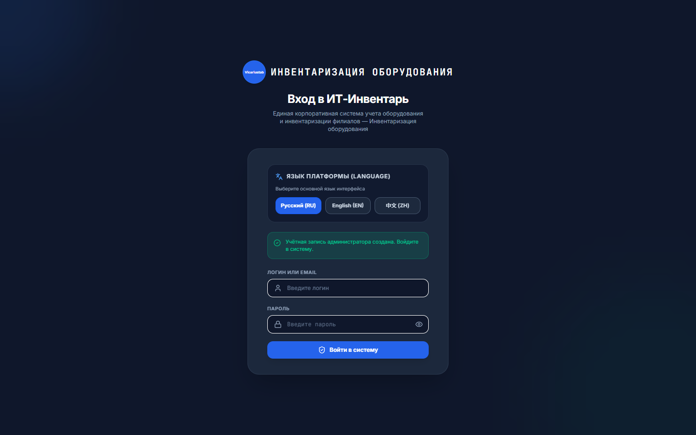
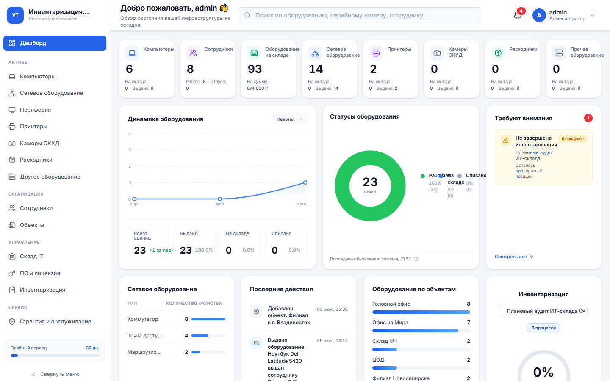
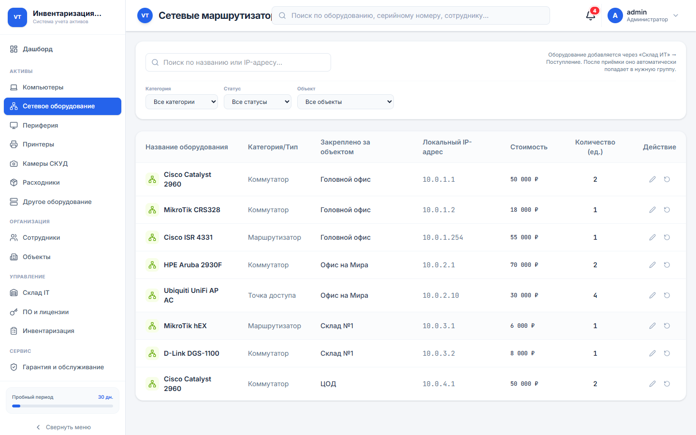
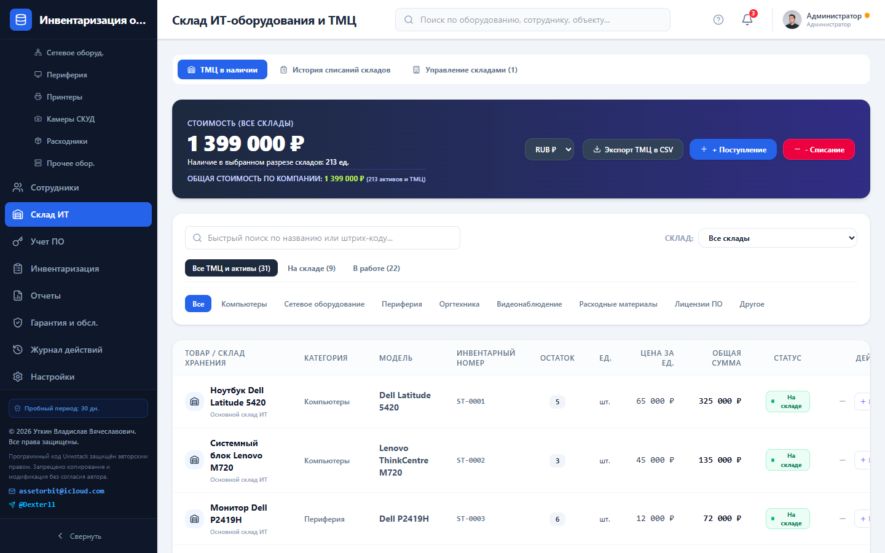
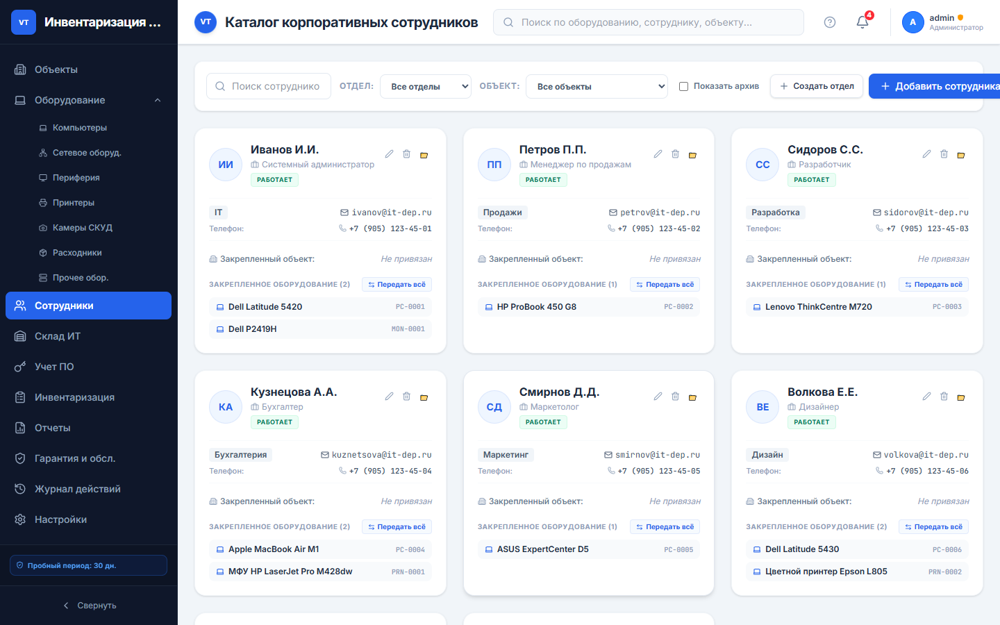
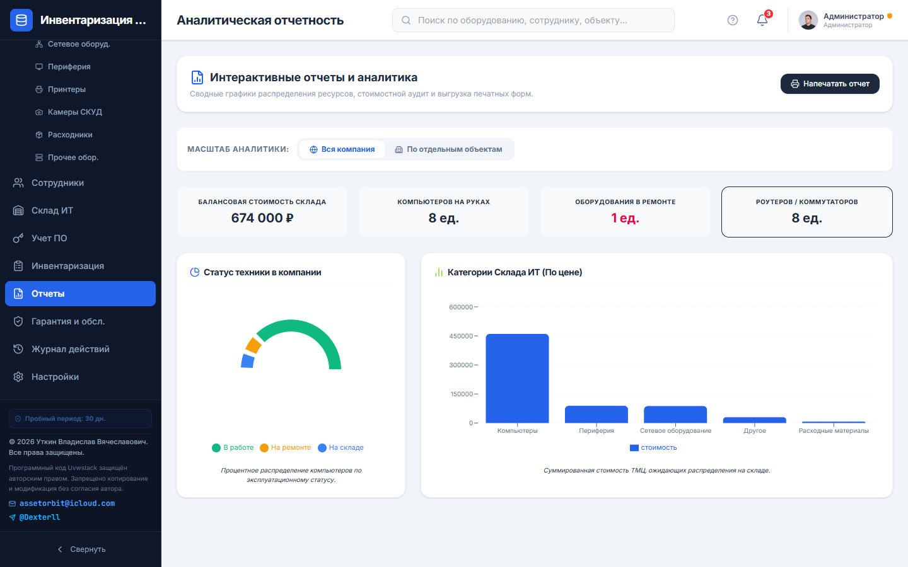
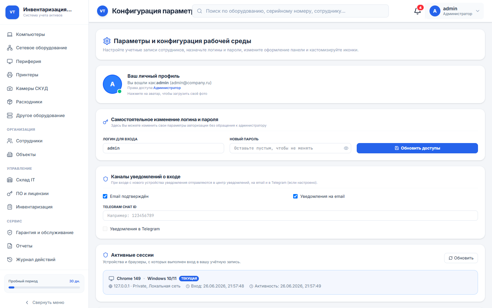
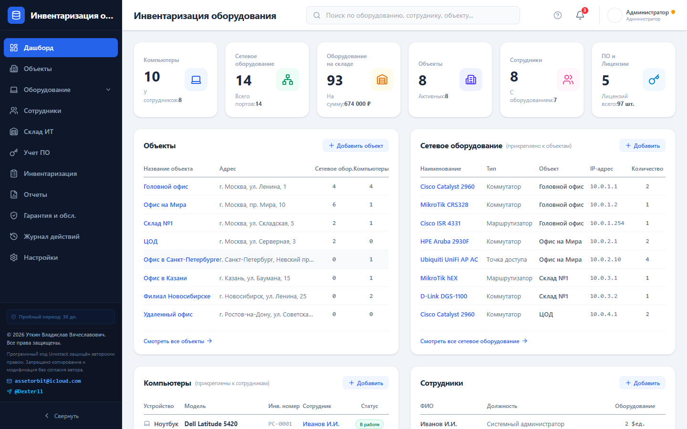

<p align="center">
  <strong>Языки документации / Documentation languages / 文档语言</strong><br>
  <a href="README.md">English</a> ·
  <a href="README.ru.md"><b>Русский</b></a> ·
  <a href="README.zh-CN.md">中文</a>
</p>

# 🚀 Uvwstack (Stack)

<p align="center">
  
  
  
  
  
</p>

<p align="center">
  <strong>Современная система учёта IT-инфраструктуры, оборудования, лицензий и складских ресурсов</strong>
</p>

---

# 📸 Скриншоты интерфейса

<p align="center">
  
  <br><em>Экран авторизации</em>
</p>

| Дашборд | Сетевое оборудование |
| :---: | :---: |
|  |  |

| Склад ИТ | Сотрудники |
| :---: | :---: |
|  |  |

| Отчёты | Настройки |
| :---: | :---: |
|  |  |

<p align="center">
  
  <br><em>Учёт компьютеров и оборудования</em>
</p>

---

## 📋 Содержание

- [Скриншоты интерфейса](#-скриншоты-интерфейса)
- [О проекте](#-о-проекте)
- [Основные возможности](#-основные-возможности)
- [Лицензирование](#-лицензирование)
- [Технологический стек](#-технологический-стек)
- [Системные требования](#-системные-требования)
- [Установка](#-установка)
  - [Подготовка сервера](#подготовка-сервера)
  - [Docker Compose](#-вариант-1-docker-compose-рекомендуется)
  - [Docker + MySQL](#-вариант-2-docker--mysql-в-одной-сети)
  - [Docker + PostgreSQL](#-вариант-3-docker--postgresql)
  - [Host-сеть для нативной СУБД](#-вариант-4-host-сеть--нативная-субд-на-ubuntu)
  - [PM2](#-вариант-5-нативная-установка-pm2)
- [Настройка базы данных](#-настройка-базы-данных)
  - [MySQL](#mysql)
  - [PostgreSQL](#postgresql)
- [Подключение СУБД](#-подключение-субд-в-uvwstack)
- [Структура проекта](#-структура-проекта)
- [Переменные окружения](#-переменные-окружения)
- [Обновление системы](#-обновление-системы)
- [Устранение неполадок](#-устранение-неполадок)
- [Авторское право](#-авторское-право)
- [Контакты](#-контакты)

---

# 📖 О проекте

**Uvwstack** (интерфейс: **Stack**) — профессиональная веб-система централизованного учёта и инвентаризации IT-активов предприятия.

Платформа предназначена для:

- системных администраторов;
- IT-отделов;
- материально ответственных лиц;
- технических служб предприятий;
- государственных и коммерческих организаций.

Система позволяет вести полный учёт:

- компьютеров;
- серверов;
- сетевого оборудования;
- оргтехники;
- комплектующих;
- лицензий;
- складских запасов;
- расходных материалов;
- аудита и журнала изменений.

Все данные хранятся централизованно и доступны через веб-интерфейс из любого современного браузера. Интерфейс поддерживает **русский**, **английский** и **китайский** языки.

Репозиторий: [github.com/llDecsterll/uvwstack](https://github.com/llDecsterll/uvwstack)

---

# ✨ Основные возможности

## 🖥 Учёт оборудования

- ПК и ноутбуки
- Серверы
- Принтеры и МФУ
- Коммутаторы и маршрутизаторы
- Комплектующие
- История эксплуатации и перемещений

## 🌐 Сетевая инфраструктура

- Учёт IP-адресов
- Патч-панели
- Маршрутизаторы
- Сетевая топология
- Карта подключений

## 📦 Складской учёт

- Приход и списание
- Инвентаризация
- Остатки на складе
- Картриджи
- Расходные материалы
- Лицензии программного обеспечения

## 👥 Управление ответственными лицами

- Закрепление техники за сотрудниками
- Привязка оборудования к отделам
- История перемещений
- Контроль материальной ответственности

## 📊 Отчёты и аудит

- Дашборд с аналитикой
- Журнал активности
- Инвентаризационные проверки
- Учёт гарантий

## 🔐 Безопасность

- AES-256-CBC шифрование данных
- Защищённое хранение параметров подключения к СУБД
- Автоматическое переподключение и мониторинг состояния БД
- Резервное копирование с исключением лицензионных полей
- Работа в распределённой инфраструктуре (Docker, PM2, MySQL, PostgreSQL)

---

# 🔑 Лицензирование

Система использует механизм аппаратно-привязанной активации.

### Ознакомительный период

- 30 дней бесплатного использования
- Отсчёт начинается после первого запуска

### Активация

При установке автоматически формируется код запроса:

```text
REQ-XXXX-XXXX-XXXX-CHKS
```

На основе данного запроса выдаётся ключ вида:

```text
UTKIN-XXXX-XXXX-XXXX
```

### Особенности лицензии

✅ Привязка к оборудованию (MAC-адрес)

✅ Проверка цифровой подписи ключа

✅ Защита от копирования и подбора ключей

✅ Отдельный сервер лицензирования (keyserver)

❌ Генерация ключей внутри клиента невозможна

---

# 🛠 Технологический стек

| Компонент | Технология |
|-----------|------------|
| Frontend | React 19, TypeScript, Tailwind CSS 4, Motion |
| Backend | Node.js 20, Express |
| API | REST (Express) |
| База данных | JSON (файл) / MySQL 8 / PostgreSQL 16 |
| Сборка | Vite 6, esbuild |
| Контейнеризация | Docker, Docker Compose |
| Процесс-менеджер | PM2 |
| Шифрование | AES-256-CBC |
| Reverse proxy | Nginx, Caddy (опционально) |

---

# 💻 Системные требования

| Ресурс | Минимум | Рекомендуется |
|--------|---------|---------------|
| ОС | Ubuntu 20.04+ / Debian 11+ | Ubuntu 22.04 LTS |
| CPU | 1 ядро | 2 ядра |
| RAM | 1 GB | 2 GB (+ СУБД на том же сервере) |
| Диск | 10 GB свободно | 20 GB |
| Сеть | Порт 8080 (HTTP) | 443 (HTTPS через прокси) |
| Браузер | Chrome, Firefox, Edge (актуальные версии) | — |

---

# 🚀 Установка

## Подготовка сервера

```bash
cd ~

sudo apt update && sudo apt upgrade -y
sudo apt install -y git curl ca-certificates
```

При необходимости очистите старую копию:

```bash
rm -rf uvwstack
```

---

## Клонирование репозитория

```bash
git clone https://github.com/llDecsterll/uvwstack.git

cd uvwstack

cp .env.example .env
```

> **Важно:** откройте `.env` и задайте надёжный `DB_ENCRYPTION_KEY` — длинная случайная строка для шифрования данных.

---

# 🐳 Вариант 1: Docker Compose (Рекомендуется)

Подходит для быстрого старта с хранением данных в JSON (том Docker).

## Установка Docker

```bash
sudo apt update

sudo apt install -y docker.io docker-compose-v2

sudo usermod -aG docker $USER
```

Перезайдите в SSH-сессию.

---

## Запуск проекта

```bash
docker compose build --no-cache

docker compose up -d
```

Проверка статуса:

```bash
docker compose ps
docker compose logs -f uvwstack-app
```

После завершения сборки система будет доступна в браузере:

```text
http://IP_СЕРВЕРА:8080
```

Данные сохраняются в Docker-томе `uvwstack_data` → `/app/data/`.

---

# 🐳 Вариант 2: Docker + MySQL в одной сети

**Рекомендуется для production** — приложение и MySQL в одном Compose, без ручной настройки сети.

```bash
docker compose -f docker-compose.yml -f docker-compose.mysql.yml up -d --build
```

| Параметр | Значение |
|----------|----------|
| Хост | `mysql` |
| База данных | `stack_db` |
| Пользователь | `stack_user` |
| Порт | `3306` |

Пароли задаются в `.env` (`MYSQL_PASSWORD`, `MYSQL_ROOT_PASSWORD`) — см. `.env.example`.

Stack автоматически подключается к БД при первом запуске (переменные `STACK_DEFAULT_DB_*`).

---

# 🐳 Вариант 3: Docker + PostgreSQL

```bash
docker compose -f docker-compose.yml -f docker-compose.postgres.yml up -d --build
```

| Параметр | Значение |
|----------|----------|
| Хост | `postgres` |
| База данных | `stack_db` |
| Пользователь | `stack_user` |
| Порт | `5432` |

---

# 🐳 Вариант 4: Host-сеть + нативная СУБД на Ubuntu

Если MySQL или PostgreSQL установлены **на самом сервере** и слушают `127.0.0.1`, используйте режим host-сети — тогда `localhost` в контейнере = localhost Ubuntu:

```bash
docker compose -f docker-compose.yml -f docker-compose.host.yml up -d --build
```

В настройках СУБД укажите хост **`localhost`**.

---

# ⚙ Вариант 5: Нативная установка (PM2)

## Установка Node.js 20

```bash
curl -fsSL https://deb.nodesource.com/setup_20.x | sudo -E bash -

sudo apt install -y nodejs build-essential
```

---

## Установка зависимостей

```bash
cp .env.example .env

npm install

npm run build
```

---

## Установка PM2

```bash
sudo npm install -g pm2
```

---

## Запуск приложения

```bash
PORT=8080 NODE_ENV=production pm2 start dist/server.cjs --name "uvwstack-system"
```

---

## Автозапуск после перезагрузки

```bash
pm2 startup systemd
```

Выполните команду, которую покажет PM2.

После этого:

```bash
pm2 save
```

---

# 🗄 Настройка базы данных

Используйте эти инструкции, если СУБД установлена **на Ubuntu отдельно** (не в Docker Compose).

## MySQL

### Установка

```bash
sudo apt update

sudo apt install -y mysql-server

sudo systemctl enable mysql
sudo systemctl start mysql
```

### Доступ из Docker (bind-address)

Если Stack работает в Docker (bridge-режим), MySQL должен принимать подключения не только с `127.0.0.1`:

```bash
sudo nano /etc/mysql/mysql.conf.d/mysqld.cnf
```

Измените:

```ini
bind-address = 0.0.0.0
```

```bash
sudo systemctl restart mysql
```

### Создание БД

```sql
CREATE DATABASE stack_db CHARACTER SET utf8mb4 COLLATE utf8mb4_unicode_ci;

CREATE USER 'stack_user'@'%' IDENTIFIED BY 'StrongSecPassword@2026';

GRANT ALL PRIVILEGES ON stack_db.* TO 'stack_user'@'%';

FLUSH PRIVILEGES;
```

### Firewall (при необходимости)

```bash
sudo ufw allow 3306/tcp
sudo ufw reload
```

---

## PostgreSQL

### Установка

```bash
sudo apt update

sudo apt install -y postgresql postgresql-contrib
```

### Сетевой доступ

```bash
sudo nano /etc/postgresql/*/main/postgresql.conf
```

```ini
listen_addresses = '*'
```

```bash
sudo nano /etc/postgresql/*/main/pg_hba.conf
```

Добавьте в конец:

```text
host    all    all    0.0.0.0/0    scram-sha-256
```

```bash
sudo systemctl restart postgresql
```

### Создание пользователя и базы

```sql
CREATE USER stack_user WITH PASSWORD 'StrongSecPassword@2026';

CREATE DATABASE stack_db OWNER stack_user;
```

---

# 🔗 Подключение СУБД в Uvwstack

После запуска системы откройте:

```text
http://SERVER_IP:8080
```

### Стандартные данные входа

```text
Логин: admin
Пароль: admin
```

> Смените пароль администратора сразу после первого входа.

### Переход в настройки

**Настройки** → вкладка **«Параметры СУБД (MySQL / PostgreSQL)»**

### Настройки подключения

| Параметр | Docker + MySQL | Docker bridge + нативная СУБД | Host-сеть / PM2 |
|----------|----------------|------------------------------|-----------------|
| Тип БД | MySQL / PostgreSQL | MySQL / PostgreSQL | MySQL / PostgreSQL |
| Хост | `mysql` или `postgres` | `172.17.0.1` или `host.docker.internal` | `localhost` |
| База данных | `stack_db` | `stack_db` | `stack_db` |
| Пользователь | `stack_user` | `stack_user` | `stack_user` |
| Порт MySQL | `3306` | `3306` | `3306` |
| Порт PostgreSQL | `5432` | `5432` | `5432` |

> **Важно:** `localhost` внутри Docker-контейнера — это **не** сервер Ubuntu. Для нативной СУБД используйте `172.17.0.1`, host-сеть или Compose с MySQL.

### Проверка и миграция

1. Нажмите **«Проверить соединение»** — при успехе отобразится рабочий хост.
2. Нажмите **«Применить СУБД и мигрировать»**.

Система автоматически:

- создаст таблицы;
- выполнит миграции;
- зашифрует настройки подключения;
- перенесёт существующие данные из JSON;
- настроит автоматическое подключение и мониторинг.

---

# 📂 Структура проекта

```text
uvwstack/
│
├── src/                          # React-интерфейс
│   ├── components/               # Модули: компьютеры, сеть, склад, настройки…
│   ├── utils/                    # Лицензия, i18n, обновления
│   └── config/                   # Версия, репозиторий обновлений
├── server.ts                     # Express API, СУБД, шифрование
├── Dockerfile
├── docker-compose.yml            # Только приложение
├── docker-compose.mysql.yml      # + MySQL
├── docker-compose.postgres.yml   # + PostgreSQL
├── docker-compose.host.yml       # Host-сеть
├── docker-compose.ssl.yml        # SSL (опционально)
├── docker-compose.caddy.yml      # Caddy (опционально)
├── nginx.conf
├── scripts/
│   ├── verify-flow.mjs           # Smoke-тесты
│   └── capture-screenshots.mjs   # Скриншоты для README
├── docs/screenshots/
│   ├── ru/                       # Скриншоты (README.ru.md)
│   ├── en/                       # Screenshots (README.md)
│   └── zh/                       # 截图 (README.zh-CN.md)
├── package.json
├── .env.example
├── README.md                     # English
├── README.ru.md                  # Русский
├── README.zh-CN.md               # 中文
├── DOCKER.md                     # Расширенное руководство (RU)
└── COPYRIGHT.md
```

---

# 🔧 Переменные окружения

| Переменная | Описание |
|------------|----------|
| `PORT` | HTTP-порт приложения (по умолчанию 3000, в Docker — 8080) |
| `NODE_ENV` | `production` / `development` |
| `DB_ENCRYPTION_KEY` | Ключ AES-256 для шифрования данных и учётных данных СУБД |
| `STACK_DATA_DIR` | Каталог данных (`db.json`, `db_config.json`); в Docker: `/app/data` |
| `DB_HOST_GATEWAY` | Алиас хоста для доступа к СУБД из Docker |
| `GITHUB_UPDATE_REPO` | URL репозитория для проверки обновлений |
| `STACK_DEFAULT_DB_TYPE` | Автоподключение: тип СУБД (`mysql` / `postgres`) |
| `STACK_DEFAULT_DB_HOST` | Автоподключение: хост |
| `STACK_DEFAULT_DB_PORT` | Автоподключение: порт |
| `STACK_DEFAULT_DB_NAME` | Автоподключение: имя базы |
| `STACK_DEFAULT_DB_USER` | Автоподключение: пользователь |
| `STACK_DEFAULT_DB_PASSWORD` | Автоподключение: пароль |
| `MYSQL_PASSWORD` | Пароль пользователя MySQL в Compose |
| `MYSQL_ROOT_PASSWORD` | Root-пароль MySQL в Compose |
| `POSTGRES_PASSWORD` | Пароль PostgreSQL в Compose |

Пример `.env`:

```env
PORT=8080

NODE_ENV=production

DB_ENCRYPTION_KEY=your-long-random-secret-key-here

STACK_DATA_DIR=/app/data

DB_HOST_GATEWAY=host.docker.internal

GITHUB_UPDATE_REPO=https://github.com/llDecsterll/uvwstack.git
```

---

# 🔄 Обновление системы

### Docker

```bash
cd ~/uvwstack

git pull origin main

docker compose down

docker compose up -d --build
```

С MySQL:

```bash
docker compose -f docker-compose.yml -f docker-compose.mysql.yml up -d --build
```

### PM2

```bash
cd ~/uvwstack

git pull origin main

npm install

npm run build

pm2 restart uvwstack-system
```

### Через интерфейс

**Настройки** → **Центр управления обновлениями Stack** — проверка релизов на GitHub.

---

# 🔧 Устранение неполадок

| Проблема | Решение |
|----------|---------|
| **Connection refused к СУБД из Docker** | Хост `172.17.0.1`; MySQL: `bind-address=0.0.0.0`; или `docker-compose.host.yml` |
| **Тест подключения не проходит** | Проверьте пароль; если сохранён — оставьте поле пустым или введите заново |
| **Dockerfile не найден** | Запускайте из корня `~/uvwstack`, не из вложенной папки |
| **Порт 8080 занят** | Измените `PORT` и маппинг портов в `docker-compose.yml` |
| **Сборка падает по памяти** | В Dockerfile уже `SKIP_OBFUSCATION=true` |

Проверка шлюза Docker:

```bash
ip addr show docker0 | grep inet
# Обычно: 172.17.0.1
```

Логи:

```bash
docker compose logs -f uvwstack-app
```

Подробнее: [DOCKER.md](./DOCKER.md)

---

# 📜 Авторское право

© Уткин Владислав Вячеславович (Utkin Vladislav Vyacheslavovich)

Все права защищены.

Подробная информация находится в файле:

```text
COPYRIGHT.md
```

---

# 📞 Контакты

📧 E-mail:

```text
assetorbit@icloud.com
```

📨 Telegram:

```text
@Dexterll
```

🌐 GitHub:

```text
https://github.com/llDecsterll/uvwstack
```

---

# ⭐ Поддержка проекта

Если Uvwstack оказался полезным:

- Поставьте ⭐ репозиторию
- Сообщайте об ошибках через [Issues](https://github.com/llDecsterll/uvwstack/issues)
- Предлагайте новые функции
- Свяжитесь для получения корпоративной лицензии

---

<p align="center">
  Сделано для эффективного управления IT-инфраструктурой 🚀
</p>
