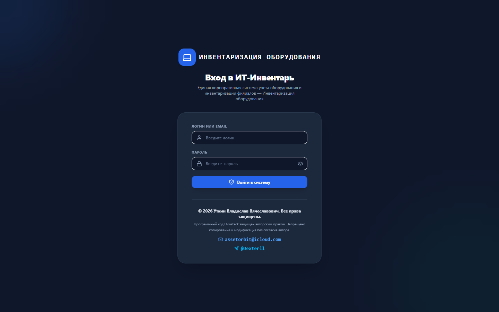
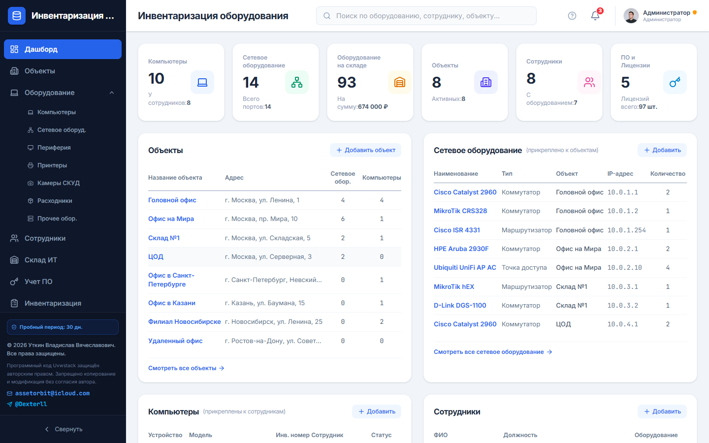
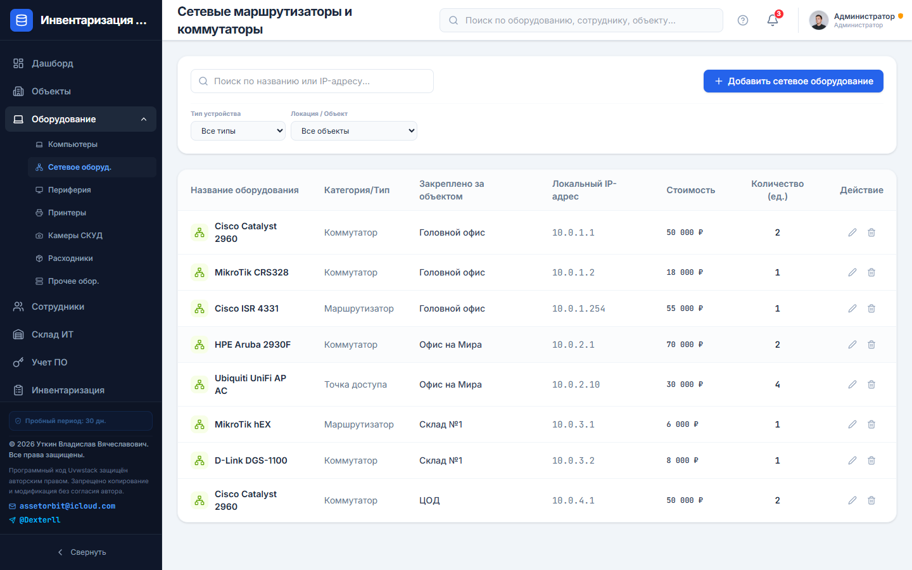
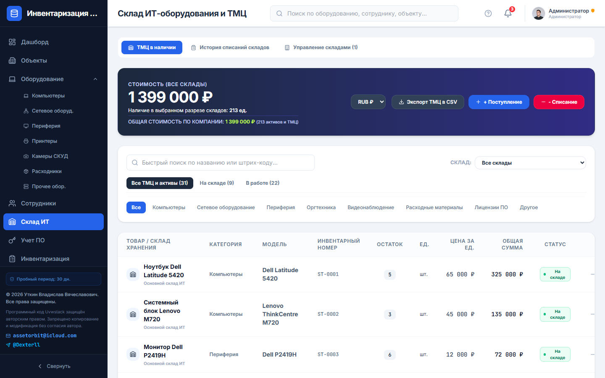
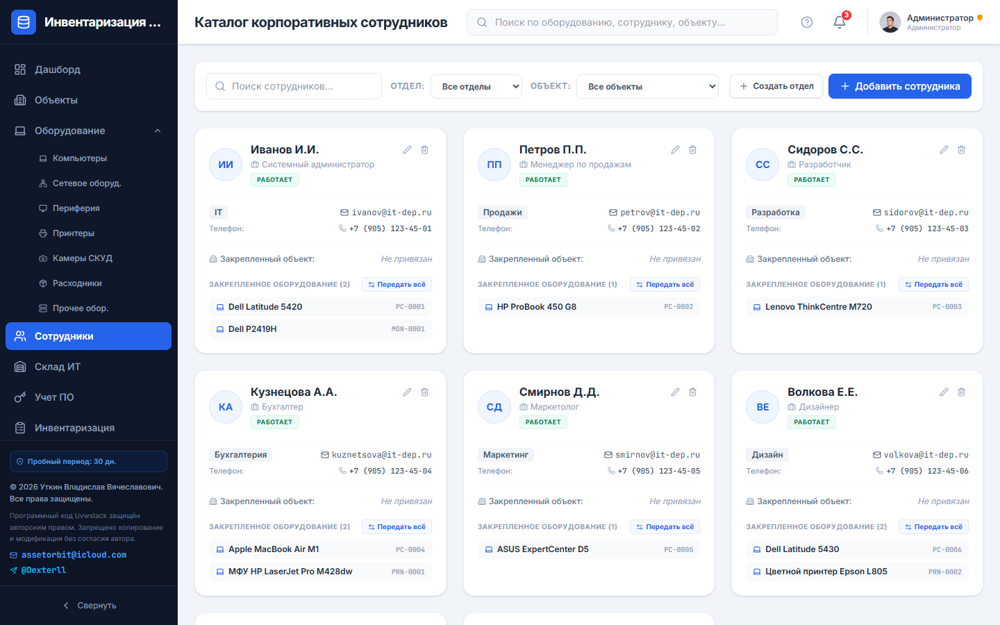
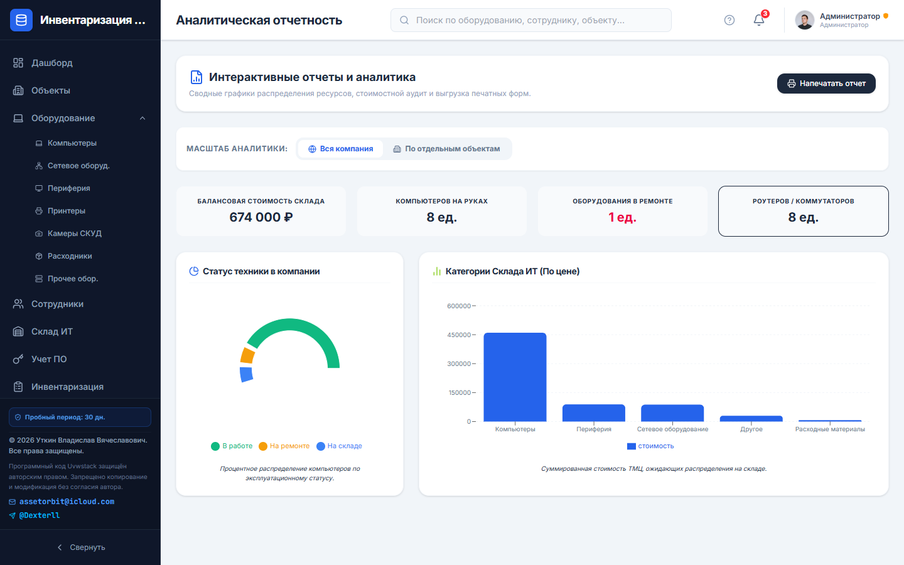
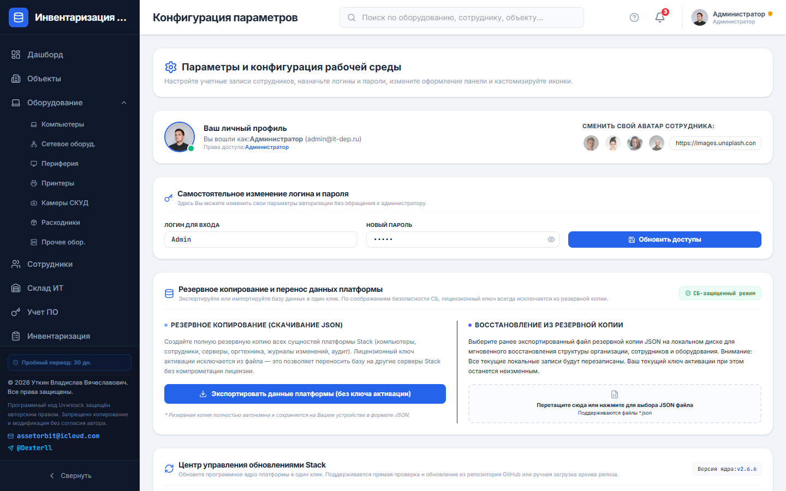
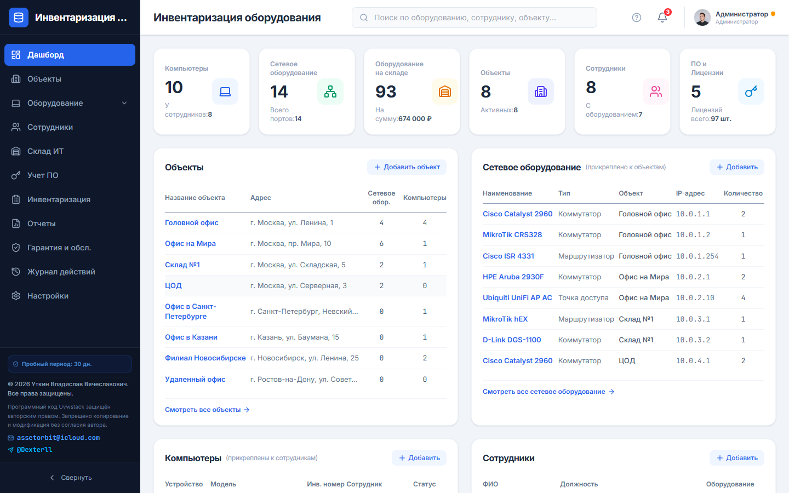

<p align="center">
  <strong>文档语言 / Documentation languages / Языки документации</strong><br>
  <a href="README.md">English</a> ·
  <a href="README.ru.md">Русский</a> ·
  <a href="README.zh-CN.md"><b>中文</b></a>
</p>

# 🚀 Uvwstack (Stack)

<p align="center">
  
  
  
  
  
</p>

<p align="center">
  <strong>现代化 IT 基础设施、设备、许可证与仓库管理系统</strong>
</p>

---

# 📸 界面截图

<p align="center">
  
  <br><em>登录界面</em>
</p>

| 仪表盘 | 网络设备 |
| :---: | :---: |
|  |  |

| IT 仓库 | 员工 |
| :---: | :---: |
|  |  |

| 报表 | 设置 |
| :---: | :---: |
|  |  |

<p align="center">
  
  <br><em>计算机与设备管理</em>
</p>

> 本地重新生成：`npm run build && npm run screenshots` → [`docs/screenshots/`](docs/screenshots/)

---

## 📋 目录

- [界面截图](#-界面截图)
- [项目简介](#-项目简介)
- [主要功能](#-主要功能)
- [许可证](#-许可证)
- [技术栈](#-技术栈)
- [系统要求](#-系统要求)
- [安装部署](#-安装部署)
  - [服务器准备](#服务器准备)
  - [Docker Compose](#-方式-1docker-compose推荐)
  - [Docker + MySQL](#-方式-2docker--mysql-同一网络)
  - [Docker + PostgreSQL](#-方式-3docker--postgresql)
  - [Host 网络 + 本地数据库](#-方式-4host-网络--ubuntu-本地数据库)
  - [PM2](#-方式-5原生安装-pm2)
- [数据库配置](#-数据库配置)
  - [MySQL](#mysql)
  - [PostgreSQL](#postgresql)
- [连接数据库](#-在-uvwstack-中连接数据库)
- [项目结构](#-项目结构)
- [环境变量](#-环境变量)
- [系统更新](#-系统更新)
- [故障排除](#-故障排除)
- [版权](#-版权)
- [联系方式](#-联系方式)

---

# 📖 项目简介

**Uvwstack**（界面名称：**Stack**）是企业级 IT 资产集中管理与盘点 Web 平台。

适用于：

- 系统管理员；
- IT 部门；
- 资产管理员；
- 企业技术服务部门；
- 政府及商业机构。

全面管理：

- 计算机；
- 服务器；
- 网络设备；
- 办公设备；
- 配件；
- 软件许可证；
- 仓库库存；
- 耗材；
- 审计与操作日志。

数据集中存储，通过现代浏览器访问。界面支持**中文**、**俄语**和**英语**。

代码仓库：[github.com/llDecsterll/uvwstack](https://github.com/llDecsterll/uvwstack)

---

# ✨ 主要功能

## 🖥 设备管理

- 台式机与笔记本
- 服务器
- 打印机与多功能一体机
- 交换机与路由器
- 配件
- 使用与转移历史

## 🌐 网络基础设施

- IP 地址管理
- 配线架
- 路由器
- 网络拓扑
- 连接图

## 📦 仓库管理

- 入库与出库
- 盘点
- 库存余额
- 硒鼓
- 耗材
- 软件许可证

## 👥 责任人管理

- 设备分配给员工
- 按部门关联资产
- 转移历史
- 物资责任追踪

## 📊 报表与审计

- 分析仪表盘
- 操作日志
- 盘点审计
- 保修管理

## 🔐 安全

- AES-256-CBC 数据加密
- 数据库连接凭据加密存储
- 自动重连与健康监控
- 备份排除许可证字段
- 分布式部署（Docker、PM2、MySQL、PostgreSQL）

---

# 🔑 许可证

硬件绑定激活机制。

### 试用期

- 30 天免费使用
- 自首次启动开始计时

### 激活

安装后自动生成请求码：

```text
REQ-XXXX-XXXX-XXXX-CHKS
```

据此签发许可证密钥：

```text
UTKIN-XXXX-XXXX-XXXX
```

### 许可证特性

✅ 硬件绑定（MAC 地址）

✅ 数字签名验证

✅ 防复制与防暴力破解

✅ 独立许可证服务器（keyserver）

❌ 客户端无法本地生成有效密钥

---

# 🛠 技术栈

| 组件 | 技术 |
|------|------|
| 前端 | React 19、TypeScript、Tailwind CSS 4、Motion |
| 后端 | Node.js 20、Express |
| API | REST（Express） |
| 数据库 | JSON（文件）/ MySQL 8 / PostgreSQL 16 |
| 构建 | Vite 6、esbuild |
| 容器 | Docker、Docker Compose |
| 进程管理 | PM2 |
| 加密 | AES-256-CBC |
| 反向代理 | Nginx、Caddy（可选） |

---

# 💻 系统要求

| 资源 | 最低 | 推荐 |
|------|------|------|
| 操作系统 | Ubuntu 20.04+ / Debian 11+ | Ubuntu 22.04 LTS |
| CPU | 1 核 | 2 核 |
| 内存 | 1 GB | 2 GB（同机部署数据库时） |
| 磁盘 | 10 GB 可用 | 20 GB |
| 网络 | 8080 端口（HTTP） | 443（HTTPS 代理） |
| 浏览器 | Chrome、Firefox、Edge（最新版） | — |

---

# 🚀 安装部署

## 服务器准备

```bash
cd ~

sudo apt update && sudo apt upgrade -y
sudo apt install -y git curl ca-certificates
```

如需清理旧副本：

```bash
rm -rf uvwstack
```

---

## 克隆仓库

```bash
git clone https://github.com/llDecsterll/uvwstack.git

cd uvwstack

cp .env.example .env
```

> **重要：** 在 `.env` 中设置安全的 `DB_ENCRYPTION_KEY` — 用于数据加密的长随机字符串。

---

# 🐳 方式 1：Docker Compose（推荐）

快速启动，数据以 JSON 形式保存在 Docker 卷中。

## 安装 Docker

```bash
sudo apt update

sudo apt install -y docker.io docker-compose-v2

sudo usermod -aG docker $USER
```

重新登录 SSH 会话。

---

## 启动项目

```bash
docker compose build --no-cache

docker compose up -d
```

检查状态：

```bash
docker compose ps
docker compose logs -f uvwstack-app
```

浏览器访问：

```text
http://服务器IP:8080
```

数据保存在 Docker 卷 `uvwstack_data` → `/app/data/`。

---

# 🐳 方式 2：Docker + MySQL（同一网络）

**生产环境推荐** — 应用与 MySQL 在同一 Compose 栈中。

```bash
docker compose -f docker-compose.yml -f docker-compose.mysql.yml up -d --build
```

| 参数 | 值 |
|------|-----|
| 主机 | `mysql` |
| 数据库 | `stack_db` |
| 用户 | `stack_user` |
| 端口 | `3306` |

密码在 `.env` 中配置（`MYSQL_PASSWORD`、`MYSQL_ROOT_PASSWORD`）— 见 `.env.example`。

首次启动时 Stack 通过 `STACK_DEFAULT_DB_*` 环境变量自动连接。

---

# 🐳 方式 3：Docker + PostgreSQL

```bash
docker compose -f docker-compose.yml -f docker-compose.postgres.yml up -d --build
```

| 参数 | 值 |
|------|-----|
| 主机 | `postgres` |
| 数据库 | `stack_db` |
| 用户 | `stack_user` |
| 端口 | `5432` |

---

# 🐳 方式 4：Host 网络 + Ubuntu 本地数据库

若 MySQL 或 PostgreSQL **安装在宿主机**且监听 `127.0.0.1`，使用 Host 网络模式：

```bash
docker compose -f docker-compose.yml -f docker-compose.host.yml up -d --build
```

在 Stack 数据库设置中填写主机 **`localhost`**。

---

# ⚙ 方式 5：原生安装（PM2）

## 安装 Node.js 20

```bash
curl -fsSL https://deb.nodesource.com/setup_20.x | sudo -E bash -

sudo apt install -y nodejs build-essential
```

---

## 安装依赖

```bash
cp .env.example .env

npm install

npm run build
```

---

## 安装 PM2

```bash
sudo npm install -g pm2
```

---

## 启动应用

```bash
PORT=8080 NODE_ENV=production pm2 start dist/server.cjs --name "uvwstack-system"
```

---

## 开机自启

```bash
pm2 startup systemd
```

执行 PM2 输出的命令，然后：

```bash
pm2 save
```

---

# 🗄 数据库配置

适用于在 **Ubuntu 本地安装**数据库（非 Docker Compose）的情况。

## MySQL

### 安装

```bash
sudo apt update

sudo apt install -y mysql-server

sudo systemctl enable mysql
sudo systemctl start mysql
```

### Docker 访问（bind-address）

若 Stack 在 Docker bridge 模式运行，MySQL 需接受 `127.0.0.1` 以外的连接：

```bash
sudo nano /etc/mysql/mysql.conf.d/mysqld.cnf
```

设置为：

```ini
bind-address = 0.0.0.0
```

```bash
sudo systemctl restart mysql
```

### 创建数据库

```sql
CREATE DATABASE stack_db CHARACTER SET utf8mb4 COLLATE utf8mb4_unicode_ci;

CREATE USER 'stack_user'@'%' IDENTIFIED BY 'StrongSecPassword@2026';

GRANT ALL PRIVILEGES ON stack_db.* TO 'stack_user'@'%';

FLUSH PRIVILEGES;
```

### 防火墙（如需要）

```bash
sudo ufw allow 3306/tcp
sudo ufw reload
```

---

## PostgreSQL

### 安装

```bash
sudo apt update

sudo apt install -y postgresql postgresql-contrib
```

### 网络访问

```bash
sudo nano /etc/postgresql/*/main/postgresql.conf
```

```ini
listen_addresses = '*'
```

```bash
sudo nano /etc/postgresql/*/main/pg_hba.conf
```

在末尾添加：

```text
host    all    all    0.0.0.0/0    scram-sha-256
```

```bash
sudo systemctl restart postgresql
```

### 创建用户与数据库

```sql
CREATE USER stack_user WITH PASSWORD 'StrongSecPassword@2026';

CREATE DATABASE stack_db OWNER stack_user;
```

---

# 🔗 在 Uvwstack 中连接数据库

启动后访问：

```text
http://服务器IP:8080
```

### 默认登录

```text
用户名: admin
密码: admin
```

> 首次登录后请立即修改管理员密码。

### 设置路径

**设置** → **数据库（MySQL / PostgreSQL）**

### 连接参数

| 参数 | Docker + MySQL | Docker bridge + 本地库 | Host 网络 / PM2 |
|------|----------------|-------------------------|-----------------|
| 数据库类型 | MySQL / PostgreSQL | MySQL / PostgreSQL | MySQL / PostgreSQL |
| 主机 | `mysql` 或 `postgres` | `172.17.0.1` 或 `host.docker.internal` | `localhost` |
| 数据库名 | `stack_db` | `stack_db` | `stack_db` |
| 用户 | `stack_user` | `stack_user` | `stack_user` |
| MySQL 端口 | `3306` | `3306` | `3306` |
| PostgreSQL 端口 | `5432` | `5432` | `5432` |

> **注意：** Docker 容器内的 `localhost` **不是** Ubuntu 宿主机。本地数据库请用 `172.17.0.1`、Host 网络或 Compose 中的 MySQL。

### 测试与迁移

1. 点击 **测试连接** — 成功后会显示可用主机地址。
2. 点击 **应用数据库并迁移**。

系统将自动：

- 创建数据表；
- 执行迁移；
- 加密连接配置；
- 从 JSON 迁移现有数据；
- 启用自动连接与监控。

---

# 📂 项目结构

```text
uvwstack/
│
├── src/                          # React 前端
│   ├── components/               # 模块：计算机、网络、仓库、设置…
│   ├── utils/                    # 许可证、i18n、更新
│   └── config/                   # 版本、更新仓库
├── server.ts                     # Express API、数据库、加密
├── Dockerfile
├── docker-compose.yml            # 仅应用
├── docker-compose.mysql.yml      # + MySQL
├── docker-compose.postgres.yml   # + PostgreSQL
├── docker-compose.host.yml       # Host 网络
├── docker-compose.ssl.yml        # SSL（可选）
├── docker-compose.caddy.yml      # Caddy（可选）
├── nginx.conf
├── scripts/
│   ├── verify-flow.mjs           # 冒烟测试
│   └── capture-screenshots.mjs   # README 截图
├── docs/screenshots/             # 界面截图（README）
├── package.json
├── .env.example
├── README.md                     # English
├── README.ru.md                  # Русский
├── README.zh-CN.md               # 中文
├── DOCKER.md                     # 扩展指南（俄语）
└── COPYRIGHT.md
```

---

# 🔧 环境变量

| 变量 | 说明 |
|------|------|
| `PORT` | HTTP 端口（默认 3000，Docker 为 8080） |
| `NODE_ENV` | `production` / `development` |
| `DB_ENCRYPTION_KEY` | AES-256 密钥，用于数据与数据库凭据加密 |
| `STACK_DATA_DIR` | 数据目录（`db.json`、`db_config.json`）；Docker：`/app/data` |
| `DB_HOST_GATEWAY` | 从 Docker 访问数据库的主机别名 |
| `GITHUB_UPDATE_REPO` | 更新检查的仓库 URL |
| `STACK_DEFAULT_DB_TYPE` | 自动连接：数据库类型（`mysql` / `postgres`） |
| `STACK_DEFAULT_DB_HOST` | 自动连接：主机 |
| `STACK_DEFAULT_DB_PORT` | 自动连接：端口 |
| `STACK_DEFAULT_DB_NAME` | 自动连接：数据库名 |
| `STACK_DEFAULT_DB_USER` | 自动连接：用户名 |
| `STACK_DEFAULT_DB_PASSWORD` | 自动连接：密码 |
| `MYSQL_PASSWORD` | Compose 中 MySQL 用户密码 |
| `MYSQL_ROOT_PASSWORD` | Compose 中 MySQL root 密码 |
| `POSTGRES_PASSWORD` | Compose 中 PostgreSQL 密码 |

`.env` 示例：

```env
PORT=8080

NODE_ENV=production

DB_ENCRYPTION_KEY=your-long-random-secret-key-here

STACK_DATA_DIR=/app/data

DB_HOST_GATEWAY=host.docker.internal

GITHUB_UPDATE_REPO=https://github.com/llDecsterll/uvwstack.git
```

---

# 🔄 系统更新

### Docker

```bash
cd ~/uvwstack

git pull origin main

docker compose down

docker compose up -d --build
```

含 MySQL：

```bash
docker compose -f docker-compose.yml -f docker-compose.mysql.yml up -d --build
```

### PM2

```bash
cd ~/uvwstack

git pull origin main

npm install

npm run build

pm2 restart uvwstack-system
```

### 通过界面

**设置** → **Stack 更新中心** — 检查 GitHub 发布版本。

---

# 🔧 故障排除

| 问题 | 解决方案 |
|------|----------|
| **Docker 内连接数据库被拒绝** | 主机 `172.17.0.1`；MySQL：`bind-address=0.0.0.0`；或 `docker-compose.host.yml` |
| **连接测试失败** | 重新输入密码；若已保存可留空或再次输入 |
| **找不到 Dockerfile** | 在仓库根目录 `~/uvwstack` 运行，勿使用嵌套目录 |
| **8080 端口被占用** | 修改 `.env` 中的 `PORT` 及 compose 端口映射 |
| **小内存 VPS 构建失败** | Dockerfile 默认 `SKIP_OBFUSCATION=true` |

查看 Docker 网关：

```bash
ip addr show docker0 | grep inet
# 通常为：172.17.0.1
```

日志：

```bash
docker compose logs -f uvwstack-app
```

详见：[DOCKER.md](./DOCKER.md)（俄语）

---

# 📜 版权

© Utkin Vladislav Vyacheslavovich（Уткин Владислав Вячеславович）

保留所有权利。

详见：

```text
COPYRIGHT.md
```

---

# 📞 联系方式

📧 邮箱：

```text
assetorbit@icloud.com
```

📨 Telegram：

```text
@Dexterll
```

🌐 GitHub：

```text
https://github.com/llDecsterll/uvwstack
```

---

# ⭐ 支持项目

若 Uvwstack 对您有帮助：

- 为仓库点 ⭐ Star
- 通过 [Issues](https://github.com/llDecsterll/uvwstack/issues) 报告问题
- 提出新功能建议
- 联系获取企业许可证

---

<p align="center">
  为高效 IT 基础设施管理而构建 🚀
</p>
