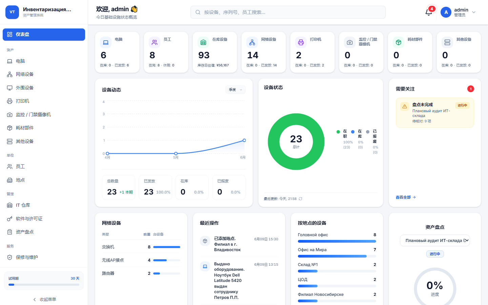
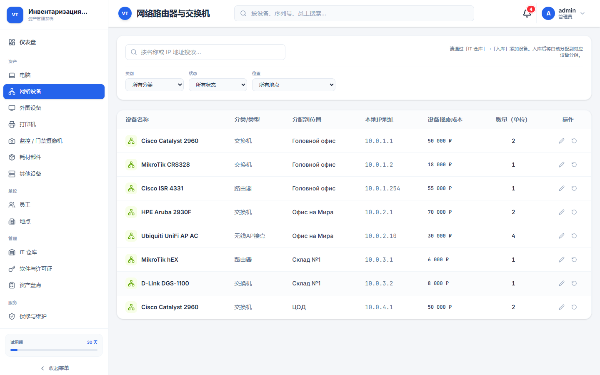
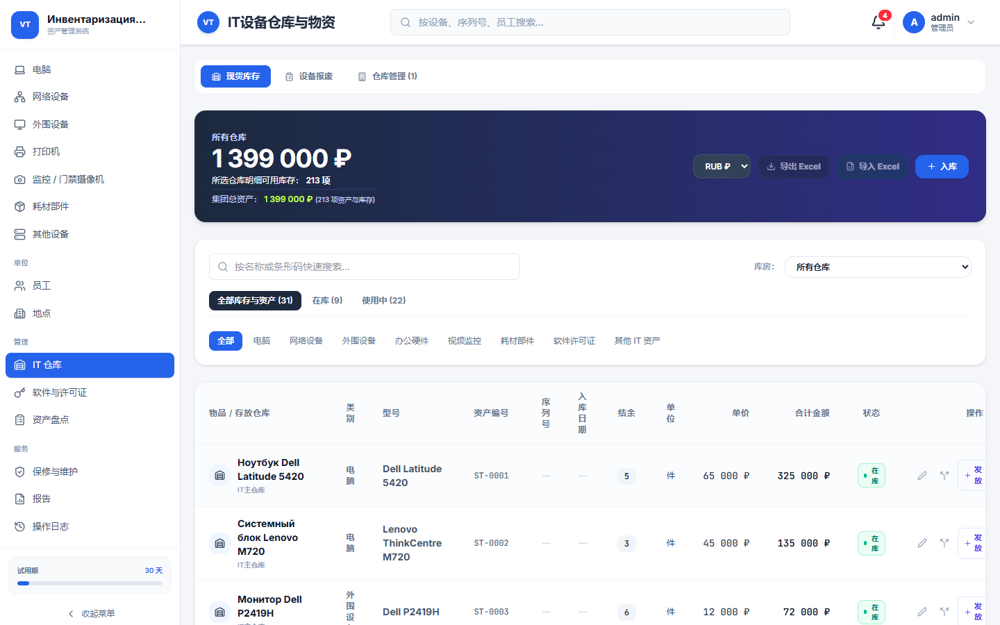
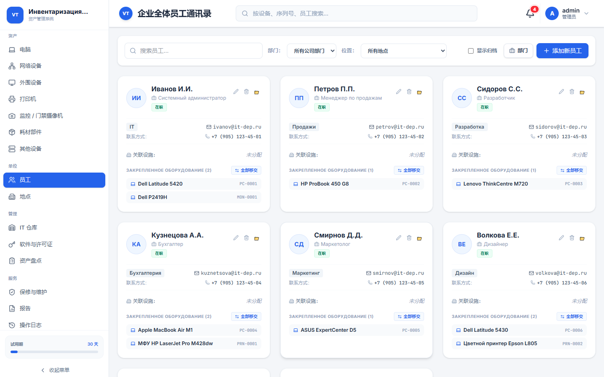
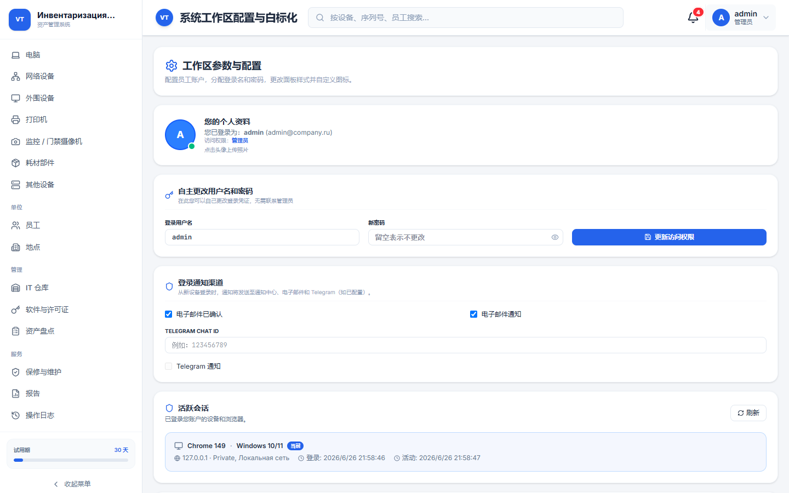
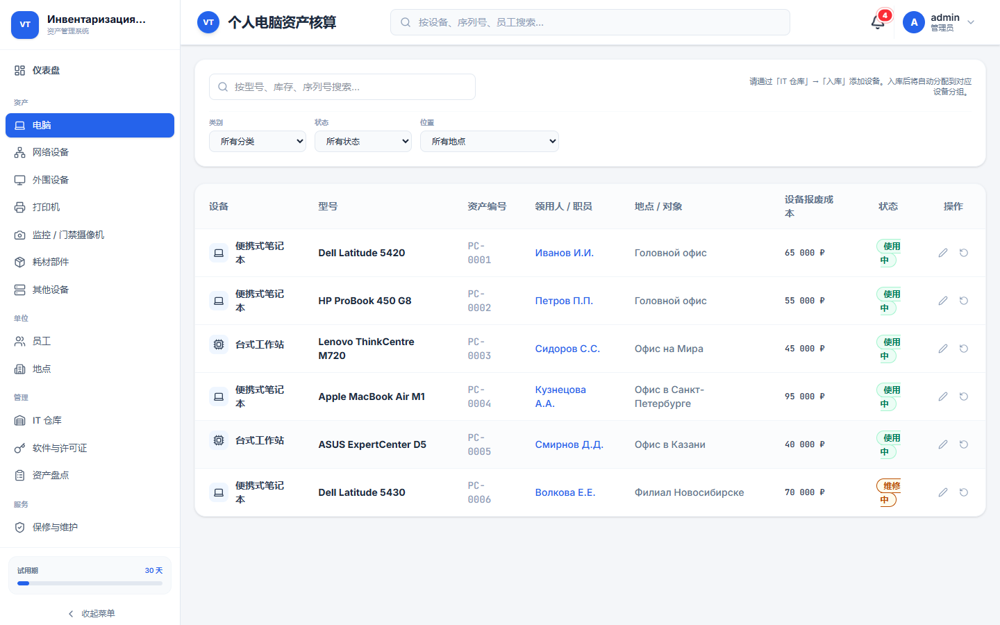

<p align="center">
  <strong>文档语言 / Documentation languages / Языки документации</strong><br>
  <a href="README.md">English</a> ·
  <a href="README.ru.md">Русский</a> ·
  <a href="README.zh-CN.md"><b>中文</b></a>
</p>

# 🚀 Vicariustab

<p align="center">
  
  
  
  
  
</p>

---

# 📸 界面截图

<p align="center">
  
  <br><em>初始配置 — 创建管理员账户</em>
</p>

<p align="center">
  
  <br><em>登录界面</em>
</p>

| 仪表盘 | 网络设备 |
| :---: | :---: |
|  |  |

| IT 仓库 | 员工 |
| :---: | :---: |
|  |  |

| 报表 | 设置 |
| :---: | :---: |
|  |  |

<p align="center">
  
  <br><em>计算机与设备管理</em>
</p>


---

## 📋 目录

- [界面截图](#-界面截图)
- [项目简介](#-项目简介)
- [主要功能](#-主要功能)
- [许可证](#-许可证)
- [技术栈](#-技术栈)
- [系统要求](#-系统要求)
- [安装部署](#-安装部署)
  - [服务器准备](#服务器准备)
  - [Docker Compose](#-方式-1docker-compose推荐)
  - [Docker + MySQL](#-方式-2docker--mysql-同一网络)
  - [Docker + PostgreSQL](#-方式-3docker--postgresql)
  - [Host 网络 + 本地数据库](#-方式-4host-网络--ubuntu-本地数据库)
  - [绑定域名与 HTTPS](#-绑定域名与-https-自动)
  - [PM2](#-方式-5原生安装-pm2)
- [首次启动](#-首次启动)
- [数据库配置](#-数据库配置)
  - [MySQL](#mysql)
  - [PostgreSQL](#postgresql)
- [连接数据库](#-在-Vicariustab-中连接数据库)
- [项目结构](#-项目结构)
- [环境变量](#-环境变量)
- [系统更新](#-系统更新)
- [故障排除](#-故障排除)
- [版权](#-版权)
- [联系方式](#-联系方式)

---

# 📖 项目简介

**Vicariustab** 是企业级 IT 资产集中管理与盘点 Web 平台。

适用于：

- 系统管理员；
- IT 部门；
- 资产管理员；
- 企业技术服务部门；
- 政府及商业机构。

全面管理：

- 计算机；
- 服务器；
- 网络设备；
- 办公设备；
- 配件；
- 软件许可证；
- 仓库库存；
- 耗材；
- 审计与操作日志。

数据集中存储，通过现代浏览器访问。界面支持**中文**、**俄语**和**英语**。

代码仓库：[github.com/llDecsterll/vicariustab](https://github.com/llDecsterll/vicariustab)

---

# ✨ 主要功能

## 🖥 设备管理

- 台式机与笔记本
- 服务器
- 打印机与多功能一体机
- 交换机与路由器
- 配件
- 使用与转移历史

## 🌐 网络基础设施

- IP 地址管理
- 配线架
- 路由器
- 网络拓扑
- 连接图

## 📦 仓库管理

- 入库与出库
- 盘点
- 库存余额
- 硒鼓
- 耗材
- 软件许可证

## 👥 责任人管理

- 设备分配给员工
- 按部门关联资产
- 转移历史
- 物资责任追踪

## 📊 报表与审计

- 分析仪表盘
- 操作日志
- 盘点审计
- 保修管理

## 🔐 安全

- AES-256-CBC 数据加密
- **Scrypt 密码哈希**（密码不以明文存储）
- **服务端身份验证** — 无有效账户无法登录
- **强制首次配置** — 无演示访问与预设用户账户
- 数据库连接凭据加密存储
- 自动重连与健康监控
- 备份排除许可证字段
- 基于角色的访问（Admin / Editor / Viewer）
- 分布式部署（Docker、PM2、MySQL、PostgreSQL）

---

# 🔑 许可证

硬件绑定激活机制。

### 试用期

- 30 天免费使用
- 自首次启动开始计时

### 迁移到新计算机

激活密钥**绑定于本机 MAC 地址**（Ed25519，`UTKIN-...` 格式）。

> **重要：**在**新计算机**上恢复数据库备份后，必须使用针对该机器 MAC 签发的许可证密钥**重新激活** Vicariustab。官方备份**从不包含**激活密钥（JSON 导出与加密 `.enc` 均强制执行）。

| 迁移方式 | 激活密钥 |
|----------|----------|
| **JSON 导出**（设置 → 平台备份） | **已排除** — 不写入文件 |
| **下载/恢复**（.enc，AES-256-CBC） | 导出与导入时**剔除** |
| 手动复制 `db.json` | **不推荐** — 可能保留旧 MAC 与密钥 |

在新计算机上通过官方方式恢复后：

- 适用**试用期**（或该电脑此前已激活的许可证）；
- **旧激活密钥不会迁移** — 需为新区 MAC 申请**新密钥**；
- **无需同时使用两个密钥** — 仅需新机器的密钥。

---

# 🛠 技术栈

| 组件 | 技术 |
|------|------|
| 前端 | React 19、TypeScript、Tailwind CSS 4、Motion |
| 后端 | Node.js 20、Express |
| API | REST（Express） |
| 数据库 | JSON（文件）/ MySQL 8 / PostgreSQL 16 |
| 构建 | Vite 6、esbuild |
| 容器 | Docker、Docker Compose |
| 进程管理 | PM2 |
| 加密 | AES-256-CBC |
| 反向代理 | Nginx、Caddy（可选） |

---

# 💻 系统要求

| 资源 | 最低 | 推荐 |
|------|------|------|
| 操作系统 | Ubuntu 20.04+ / Debian 11+ | Ubuntu 22.04 LTS |
| CPU | 1 核 | 2 核 |
| 内存 | 1 GB | 2 GB（同机部署数据库时） |
| 磁盘 | 10 GB 可用 | 20 GB |
| 网络 | 8080 端口（HTTP） | 443（HTTPS 代理） |
| 浏览器 | Chrome、Firefox、Edge（最新版） | — |

---

# 🚀 安装部署

## 服务器准备

```bash
cd ~

sudo apt update && sudo apt upgrade -y
sudo apt install -y git curl ca-certificates
```

如需清理旧副本：

```bash
rm -rf vicariustab
```

---

## 克隆仓库

```bash
git clone https://github.com/llDecsterll/vicariustab.git

cd vicariustab

cp .env.example .env
```

> **重要：** 在 `.env` 中设置安全的 `DB_ENCRYPTION_KEY` — 用于数据加密的长随机字符串。

---

# 🐳 方式 1：Docker Compose（推荐）

快速启动，数据以 JSON 形式保存在 Docker 卷中。

## 安装 Docker

```bash
sudo apt update

sudo apt install -y docker.io docker-compose-v2

sudo usermod -aG docker $USER
```

重新登录 SSH 会话。

---

## 启动项目

```bash
docker compose build --no-cache

docker compose up -d
```

检查状态：

```bash
docker compose ps
docker compose logs -f vicariustab-app
```

浏览器访问：

```text
http://服务器IP:8080
```

**首次启动**时将显示 **「初始配置」** 向导 — 使用前须先创建管理员账户。详见 [首次启动](#-首次启动)。

数据保存在 Docker 卷 `vicariustab_data` → `/app/data/`。

---

# 🐳 方式 2：Docker + MySQL（同一网络）

**生产环境推荐** — 应用与 MySQL 在同一 Compose 栈中。

```bash
docker compose -f docker-compose.yml -f docker-compose.mysql.yml up -d --build
```

| 参数 | 值 |
|------|-----|
| 主机 | `mysql` |
| 数据库 | `stack_db` |
| 用户 | `stack_user` |
| 端口 | `3306` |

密码在 `.env` 中配置（`MYSQL_PASSWORD`、`MYSQL_ROOT_PASSWORD`）— 见 `.env.example`。

首次启动时 Vicariustab 通过 `STACK_DEFAULT_DB_*` 环境变量自动连接。

---

# 🐳 方式 3：Docker + PostgreSQL

```bash
docker compose -f docker-compose.yml -f docker-compose.postgres.yml up -d --build
```

| 参数 | 值 |
|------|-----|
| 主机 | `postgres` |
| 数据库 | `stack_db` |
| 用户 | `stack_user` |
| 端口 | `5432` |

---

# 🐳 方式 4：Host 网络 + Ubuntu 本地数据库

若 MySQL 或 PostgreSQL **安装在宿主机**且监听 `127.0.0.1`，使用 Host 网络模式：

```bash
docker compose -f docker-compose.yml -f docker-compose.host.yml up -d --build
```

在 Vicariustab 数据库设置中填写主机 **`localhost`**。

---

# 🌐 绑定域名与 HTTPS（自动）

通过公网地址（`https://stack.example.com`）访问 Vicariustab 时，使用内置脚本 — 自动写入 `.env`、启动 Docker 和 Caddy（Let's Encrypt 证书）。

### 要求

- 具有公网 IP 的 VPS（Ubuntu 20.04+）
- Docker 与 Docker Compose
- DNS **A 记录**：域名 → 服务器 IP
- 端口 **80** 和 **443** 可从外网访问

### 交互式运行

```bash
cd vicariustab
npm run setup:domain
```

按提示输入 **域名** 和 **域名所有者邮箱**（Let's Encrypt），脚本会检查 DNS 并启动容器。

### 命令行参数

```bash
node scripts/setup-domain.mjs \
  --domain stack.example.com \
  --email admin@example.com \
  --ufw \
  --yes
```

| 参数 | 说明 |
|------|------|
| `--mysql` | 与 MySQL 一同启动 |
| `--ufw` | 在防火墙中开放 80/443（Linux） |
| `--check-only` | 仅检查，不启动 Docker |
| `--skip-dns` | 跳过 DNS 检查 |

配合 MySQL：

```bash
node scripts/setup-domain.mjs --domain stack.example.com --email admin@example.com --mysql --ufw -y
```

完成后访问 **`https://您的域名`** 并完成[首次启动](#-首次启动)。

> **手动配置：** 见 [`DOCKER.md`](./DOCKER.md) 与 `docker-compose.caddy.yml`。  
> **服务器上无需 keyserver** — 许可证密钥由版权所有者在本地单独签发。

更新 README 截图：

```bash
npm run build && npm run screenshots
```

---

# ⚙ 方式 5：原生安装（PM2）

## 安装 Node.js 20

```bash
curl -fsSL https://deb.nodesource.com/setup_20.x | sudo -E bash -

sudo apt install -y nodejs build-essential
```

---

## 安装依赖

```bash
cp .env.example .env

npm install

npm run build
```

---

## 安装 PM2

```bash
sudo npm install -g pm2
```

---

## 启动应用

编辑 `.env` 并设置强 `DB_ENCRYPTION_KEY`（生产环境必需）：

```bash
nano .env
```

**推荐** — 使用内置 PM2 配置（`deploy/ecosystem.config.cjs`；服务端启动时读取 `.env`）：

```bash
pm2 start deploy/ecosystem.config.cjs --env production
```

**备选** — 手动启动：

```bash
PORT=8080 NODE_ENV=production DB_ENCRYPTION_KEY="your-long-random-secret" pm2 start dist/server.cjs --name "vicariustab-system"
```

> 应用启动时从项目根目录读取 `.env`。Docker Compose 也使用 `.env` 进行变量替换。

---

## 开机自启

```bash
pm2 startup systemd
```

执行 PM2 输出的命令，然后：

```bash
pm2 save
```

---

# 👤 首次启动

安装完成后，Vicariustab **没有任何用户账户**。创建管理员之前无法使用系统。

### 步骤 1 — 初始配置（仅一次）

首次打开应用时，将显示 **「初始配置」** 表单：

| 字段 | 要求 |
|------|------|
| **登录名** | 至少 3 个字符；字母、数字、`.`、`-`、`_` |
| **密码** | 至少 **8 个字符** |
| **邮箱** | 有效的电子邮件地址 |

创建成功后将跳转到 **登录界面**。

### 步骤 2 — 登录

使用初始配置时设置的登录名和密码。身份验证在 **服务端** 完成；系统不提供内置演示账户。

### 默认工作区数据

初始配置时会自动创建 starter 数据（与全新演示环境相同）：

- 分支机构（对象）；
- 员工；
- 计算机与外设；
- IT 仓库与库存；
- 网络设备；
- 软件许可证；
- 示例盘点与活动日志。

便于立即熟悉界面，可随时修改或删除。

### 用户管理

- **无预设账户**（无演示用户）。
- 仅 **管理员** 可在 **设置** → **用户管理** 中创建新用户。
- 添加用户时密码框提示 **「至少 8 个字符」**；服务端同样校验。
- 密码以 **scrypt 哈希** 存储，不会返回浏览器。

### 本地开发

```bash
cp .env.example .env   # 可选；未设置时开发模式默认端口 3000
npm install
npm run dev
```

> `npm run dev` 通过 **tsx** 启动 TypeScript 服务器（已包含在 `devDependencies` 中）。

访问 `http://localhost:3000`（或 `.env` 中的端口）。测试全新安装时，删除数据文件并重启：

```bash
rm -f db.json store_meta.json sessions_store.enc db_config.json
```

若更改了 `DB_ENCRYPTION_KEY`，请同时删除 `sessions_store.enc`，否则日志中可能出现会话解密警告（服务器仍可运行）。

若浏览器仍显示旧登录页，请清除 `localhost` 站点数据（或使用隐私/无痕窗口）。

### 安装验证（冒烟测试）

构建后启动服务器并检查 API：

```bash
npm run build
PORT=8080 DB_ENCRYPTION_KEY="your-long-random-secret" npm start
```

另开终端：

```bash
npm run verify http://127.0.0.1:8080
npm run verify:install http://127.0.0.1:8080
npm run lint
npm run check:i18n
npm run test:unit
```

完整 audit 测试套件（需先启动服务器）：

```bash
npm run test:audit
```

预期：`ALL TESTS PASSED`、`INSTALL CHECKS PASSED`，且无 i18n 键错误。

---

# 🗄 数据库配置

适用于在 **Ubuntu 本地安装**数据库（非 Docker Compose）的情况。

## MySQL

### 安装

```bash
sudo apt update

sudo apt install -y mysql-server

sudo systemctl enable mysql
sudo systemctl start mysql
```

### Docker 访问（bind-address）

若 Vicariustab 在 Docker bridge 模式运行，MySQL 需接受 `127.0.0.1` 以外的连接：

```bash
sudo nano /etc/mysql/mysql.conf.d/mysqld.cnf
```

设置为：

```ini
bind-address = 0.0.0.0
```

```bash
sudo systemctl restart mysql
```

### 创建数据库

```sql
CREATE DATABASE stack_db CHARACTER SET utf8mb4 COLLATE utf8mb4_unicode_ci;

CREATE USER 'stack_user'@'%' IDENTIFIED BY 'StrongSecPassword@2026';

GRANT ALL PRIVILEGES ON stack_db.* TO 'stack_user'@'%';

FLUSH PRIVILEGES;
```

### 防火墙（如需要）

```bash
sudo ufw allow 3306/tcp
sudo ufw reload
```

---

## PostgreSQL

### 安装

```bash
sudo apt update

sudo apt install -y postgresql postgresql-contrib
```

### 网络访问

```bash
sudo nano /etc/postgresql/*/main/postgresql.conf
```

```ini
listen_addresses = '*'
```

```bash
sudo nano /etc/postgresql/*/main/pg_hba.conf
```

在末尾添加：

```text
host    all    all    0.0.0.0/0    scram-sha-256
```

```bash
sudo systemctl restart postgresql
```

### 创建用户与数据库

```sql
CREATE USER stack_user WITH PASSWORD 'StrongSecPassword@2026';

CREATE DATABASE stack_db OWNER stack_user;
```

---

# 🔗 在 Vicariustab 中连接数据库

启动并完成 **管理员登录** 后访问：

```text
http://服务器IP:8080
```

### 设置路径

**设置** → **数据库（MySQL / PostgreSQL）**

### 连接参数

| 参数 | Docker + MySQL | Docker bridge + 本地库 | Host 网络 / PM2 |
|------|----------------|-------------------------|-----------------|
| 数据库类型 | MySQL / PostgreSQL | MySQL / PostgreSQL | MySQL / PostgreSQL |
| 主机 | `mysql` 或 `postgres` | `172.17.0.1` 或 `host.docker.internal` | `localhost` |
| 数据库名 | `stack_db` | `stack_db` | `stack_db` |
| 用户 | `stack_user` | `stack_user` | `stack_user` |
| MySQL 端口 | `3306` | `3306` | `3306` |
| PostgreSQL 端口 | `5432` | `5432` | `5432` |

> **注意：** Docker 容器内的 `localhost` **不是** Ubuntu 宿主机。本地数据库请用 `172.17.0.1`、Host 网络或 Compose 中的 MySQL。

### 测试与迁移

1. 点击 **测试连接** — 成功后会显示可用主机地址。
2. 点击 **应用数据库并迁移**。

系统将自动：

- 创建数据表；
- 执行迁移；
- 加密连接配置；
- 从 JSON 迁移现有数据；
- 启用自动连接与监控。

---

# 📂 项目结构

```text
vicariustab/
│
├── src/                          # React 前端
│   ├── components/               # 模块：计算机、网络、仓库、设置…
│   ├── utils/                    # 许可证、i18n、更新
│   └── config/                   # 版本、更新仓库
├── server/                       # API、密码哈希、种子数据
│   ├── apiAuth.ts                # 认证中间件 + 许可证校验
│   ├── dataStore.ts              # JSON/SQL 持久化
│   ├── sessionEngine.ts          # 会话与通知
│   ├── updateEngine.ts           # GitHub 自动更新
│   ├── licenseCore.ts            # 服务端许可证
│   └── workspaceSeed.json        # 首次启动时的默认数据
├── server.ts                     # Express API、数据库、加密
├── Dockerfile
├── docker-compose.yml            # 仅应用
├── docker-compose.mysql.yml      # + MySQL
├── docker-compose.postgres.yml   # + PostgreSQL
├── docker-compose.host.yml       # Host 网络
├── docker-compose.ssl.yml        # SSL（可选）
├── docker-compose.caddy.yml      # Caddy（可选）
├── nginx.conf
├── deploy/
│   └── ecosystem.config.cjs      # PM2 生产配置
├── scripts/
│   ├── dev-server.mjs            # npm run dev
│   ├── check-i18n.mjs            # npm run check:i18n
│   ├── verify-flow.mjs           # npm run verify
│   ├── verify-install.mjs        # npm run verify:install
│   ├── verify-install.mjs        # npm run verify:install
│   ├── setup-domain.mjs          # npm run setup:domain — 域名 + HTTPS
│   └── capture-screenshots.mjs   # npm run screenshots — README 截图
├── docs/screenshots/
│   ├── ru/                       # README.ru.md
│   ├── en/                       # README.md
│   └── zh/                       # README.zh-CN.md
├── package.json
├── .env.example
├── README.md                     # English
├── README.ru.md                  # Русский
├── README.zh-CN.md               # 中文
├── DOCKER.md                     # 扩展指南（俄语）
└── COPYRIGHT.md
```

---

# 🔧 环境变量

| 变量 | 说明 |
|------|------|
| `PORT` | HTTP 端口（默认 3000，Docker 为 8080） |
| `NODE_ENV` | `production` / `development` |
| `DB_ENCRYPTION_KEY` | AES-256 密钥，用于数据与数据库凭据加密 |
| `STACK_DATA_DIR` | 数据目录（`db.json`、`db_config.json`）；Docker：`/app/data` |
| `DB_HOST_GATEWAY` | 从 Docker 访问数据库的主机别名 |
| `GITHUB_UPDATE_REPO` | 更新检查的仓库 URL |
| `STACK_DEFAULT_DB_TYPE` | 自动连接：数据库类型（`mysql` / `postgres`） |
| `STACK_DEFAULT_DB_HOST` | 自动连接：主机 |
| `STACK_DEFAULT_DB_PORT` | 自动连接：端口 |
| `STACK_DEFAULT_DB_NAME` | 自动连接：数据库名 |
| `STACK_DEFAULT_DB_USER` | 自动连接：用户名 |
| `STACK_DEFAULT_DB_PASSWORD` | 自动连接：密码 |
| `MYSQL_PASSWORD` | Compose 中 MySQL 用户密码 |
| `MYSQL_ROOT_PASSWORD` | Compose 中 MySQL root 密码 |
| `POSTGRES_PASSWORD` | Compose 中 PostgreSQL 密码 |
| `STACK_DISABLE_AUTO_UPDATE` | 设为 `true` 禁用 GitHub 自动更新 |
| `PM2_APP_NAME` | PM2 进程名（默认 `vicariustab-system`） |
| `TELEGRAM_BOT_TOKEN` | 新设备登录 Telegram 通知 |
| `RESEND_API_KEY` | 登录邮件通知 Resend API |
| `SESSION_ALERT_FROM_EMAIL` | 安全邮件发件地址 |
| `STACK_DOMAIN` | 公网域名（Docker + Caddy / 反向代理） |
| `STACK_PUBLIC_URL` | 完整 URL，如 `https://stack.example.com` |
| `STACK_TLS_EMAIL` | Let's Encrypt 联系邮箱 |
| `TRUST_PROXY` | 在 Nginx/Caddy 后设为 `true` |
| `STACK_FORCE_HTTPS` | 为 `true` 时 HTTP 重定向到 HTTPS |

`.env` 示例：

```env
PORT=8080

NODE_ENV=production

DB_ENCRYPTION_KEY=your-long-random-secret-key-here

STACK_DATA_DIR=/app/data

DB_HOST_GATEWAY=host.docker.internal

GITHUB_UPDATE_REPO=https://github.com/llDecsterll/vicariustab.git
```

---

# 🔄 系统更新

### Docker

```bash
cd ~/vicariustab

git pull origin main

docker compose down

docker compose up -d --build
```

含 MySQL：

```bash
docker compose -f docker-compose.yml -f docker-compose.mysql.yml up -d --build
```

### PM2

```bash
cd ~/vicariustab

git pull origin main

npm install

npm run build

pm2 restart deploy/ecosystem.config.cjs --env production
```

或手动启动时：`pm2 restart vicariustab-system`

### 通过界面

**设置** → **Vicariustab 更新中心** — 检查 GitHub 发布版本。

---

# 🔧 故障排除

| 问题 | 解决方案 |
|------|----------|
| **未出现初始配置向导** | 删除 `STACK_DATA_DIR` 中的 `db.json`、`store_meta.json`、`sessions_store.enc`；清除浏览器站点数据 |
| **Sessions 错误 / bad decrypt** | 更改 `DB_ENCRYPTION_KEY` 后，删除 `sessions_store.enc` 并重启 |
| **「登录名或密码错误」** | 使用初始配置时的凭据；无默认 `admin`/`admin` 账户 |
| **Docker 内连接数据库被拒绝** | 主机 `172.17.0.1`；MySQL：`bind-address=0.0.0.0`；或 `docker-compose.host.yml` |
| **连接测试失败** | 重新输入密码；若已保存可留空或再次输入 |
| **找不到 Dockerfile** | 在仓库根目录 `~/vicariustab` 运行，勿使用嵌套目录 |
| **8080 端口被占用** | 修改 `.env` 中的 `PORT` 及 compose 端口映射 |
| **小内存 VPS 构建失败** | Dockerfile 默认 `SKIP_OBFUSCATION=true` |

查看 Docker 网关：

```bash
ip addr show docker0 | grep inet
# 通常为：172.17.0.1
```

日志：

```bash
docker compose logs -f vicariustab-app
```

详见：[DOCKER.md](./DOCKER.md)（俄语）

---

# 📜 版权

© Utkin Vladislav Vyacheslavovich（Уткин Владислав Вячеславович）

保留所有权利。

详见：

```text
COPYRIGHT.md
```

---

# 📞 联系方式

📧 邮箱：

```text
vicariustab@icloud.com
```

📨 Telegram：

```text
@Dexterll
```

🌐 GitHub：

```text
https://github.com/llDecsterll/vicariustab
```

---

# ⭐ 支持项目

若 Vicariustab 对您有帮助：

- 为仓库点 ⭐ Star
- 通过 [Issues](https://github.com/llDecsterll/vicariustab/issues) 报告问题
- 提出新功能建议
- 联系获取企业许可证

---

<p align="center">
  为高效 IT 基础设施管理而构建 🚀
</p>
